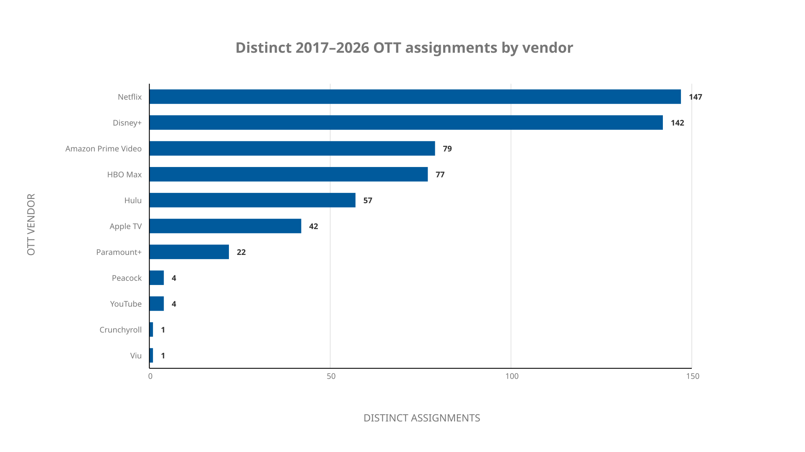

# Metadata v7.3 — OTT vendor slices

*Prepared: 2026-09-15*

*Parent plan: `20260911_metadata_v6.2.md`*

*Canonical metadata source: `/home/bkoz/src/alpha60-swarm-metadata` at
`075745a3d7592856fdf26dfb755583ee2ffd4cd0`*

*Annual cohort sources: 2017–2025 inventories from this repository at
`834229542925cd7ca99fcdafea1a3fec4a7d3d9e`; finalized 2026 inventory from
this repository at `33a2ef6df4fa5b2988776f4bcb37328f53def264`*

*Status: the Wikipedia `Streaming platforms` list, the section 2.1
normalization crosswalk, the section 2.2 Disney+ content-hub expansion
including the FX Networks family, and the section 2.3 HBO network-brand
expansion were approved by human review on 2026-09-13; platform membership
remains candidate-only, and no canonical metadata is changed by this document*

## 1. Result

The ten annual Alpha60 cohorts contain **646 cohort rows** and **644 distinct
collection keys**. A candidate match against the 51 platform labels in
Wikipedia's [Streaming platforms](https://en.wikipedia.org/wiki/Over-the-top_media_service#Streaming_platforms)
list, supplemented by the approved Disney+ content-hub rule in section 2.2,
found **499 distinct Alpha60 objects** with at least one listed OTT vendor,
yielding **576 non-exclusive object-vendor assignments** across 11 vendors.
**144 distinct objects** have no matched platform or approved brand-family
signal, and one 2026 cohort key has no canonical metadata record.

The chart therefore uses **object-vendor assignments**, not objects, as its
part-to-whole denominator. Seventy-three objects have multiple matched vendors:
69 have two and four have three. They appear in every corresponding candidate
slice. Counting each object once would require an unsupported primary-platform
choice.

## 2. Scope and method

- Population: the exact checked-in `year-YYYY-cohort.txt` inventories for
  2017–2025 plus the finalized 71-key `year-2026-cohort.txt` inventory recorded
  in `20260912_year_media_object_cache_audit_v6_stage_4.3.md`, preserving
  annual campaign grain. This is not a `release.year` filter.
- Frozen 2026 verification: 71 sorted canonical keys reproduce SHA-256
  `c43ed8309af2cca46e57f4b873377efb087b3f6b62701bd220483b81f26e9ea9`.
- Join key: `collection_key` into the 679 canonical JSON records in
  `alpha60-swarm-metadata/metadata`.
- Base evidence field: top-level `distribution_tags`, whose canonical
  provenance identifies the Wikipedia `network/distributor` source field.
  The approved Disney+ content-hub supplement also uses exact top-level
  `production_tags` values as specified in section 2.2.
- Taxonomy: the platform labels in the cited Wikipedia article, retrieved
  2026-09-12 and approved by human review on 2026-09-13 as the taxonomy for
  this candidate slicing. This approval does not itself promote candidate
  memberships into canonical Alpha60 metadata.
- Match rule: exact lower-case tag or an explicit brand-history alias only.
  Studio, rights-holder, theatrical distributor, and linear-network names are
  not promoted to OTT availability except for the explicit, candidate-only
  Disney+ content-hub rule in section 2.2.
- Membership semantics: candidate-only and non-exclusive. A platform tag does
  not establish territory, availability window, exclusivity, or current
  availability.

### 2.1 Normalization crosswalk

*Approved unchanged by human review on 2026-09-13.*

| Wikipedia vendor label | Accepted canonical `distribution_tags` values |
| --- | --- |
| Amazon Prime Video | `amazon mgm studios via prime video worldwide`, `amazon prime`, `amazon prime video`, `prime video` |
| Apple TV | `apple tv`, `apple+` |
| Crunchyroll | `crunchyroll streaming` |
| Discovery+ | `discovery+` |
| Disney+ | `disney+` |
| HBO Max | `hbo max`, `max` |
| Hulu | `fx on hulu`, `hulu`, `hulu united states`, `hulu us` |
| Netflix | `netflix`, `netflix international`, `netflix united states` |
| Paramount+ | `cbs all access`, `paramount+` |
| Peacock | `peacock` |
| Viu | `viu as me za` |
| YouTube | `youtube premium`, `youtube red`, `youtube tv` |

`cbs all access` is grouped under Paramount+ because Paramount's official
[2020 announcement](https://ir.paramount.com/news-releases/news-release-details/viacomcbs-unveils-brand-upcoming-global-streaming-service)
states that CBS All Access would be rebranded Paramount+. `max` is grouped
under HBO Max because Warner Bros. Discovery's official
[2025 announcement](https://press.wbd.com/us/media-release/warner-bros-discovery-announces-max-become-hbo-max-summer)
states that Max would be rebranded HBO Max. `youtube red` and
`youtube premium` share the YouTube vendor group because YouTube's official
[2018 announcement](https://blog.youtube/news-and-events/introducing-youtube-premium/)
states that YouTube Red became YouTube Premium. `youtube tv` is retained in
the same vendor-level group because this review slices by vendor, not by
subscription product.

### 2.2 Disney+ content-hub expansion

Disney's [Disney+ overview](https://en.wikipedia.org/wiki/Disney%2B) identifies
dedicated hubs for Disney, Pixar, Marvel, Star Wars, National Geographic,
ESPN, and Hulu, alongside Disney+ originals and exclusives. For section 5,
the Disney+ candidate slice therefore supplements the unchanged section 2.1
direct-platform crosswalk with the following exact canonical evidence:

| Disney+ hub/group | Accepted canonical evidence |
| --- | --- |
| Disney | `distribution_tags`: `disney`; `production_tags`: `walt disney animation studios`, `walt disney pictures`, `walt disney studios` |
| Pixar | `production_tags`: `pixar animation studios` |
| Marvel / MarvelTV | `production_tags`: `marvel entertainment`, `marvel studios`, `marvel studios animation`, `marvel television`, `marvel television season 1` |
| Star Wars / StarWars | `production_tags`: `lucasfilm`, `lucasfilm animation`, `lucasfilm ltd`, restricted in this cohort to records whose collection identity is a Star Wars work |
| National Geographic | exact `national geographic` tag in `distribution_tags` or `production_tags` |
| ESPN | exact `espn` tag in `distribution_tags` or `production_tags`; applicable only in the United States, Latin America, Caribbean, Australia, New Zealand, and South Africa |
| Hulu | the four unchanged Hulu aliases in section 2.1: `fx on hulu`, `hulu`, `hulu united states`, `hulu us` |
| FX Networks | `distribution_tags`: `fx`, `fx networks`, `fx movie channel`, `fxm`, `fxx`, `fx on hulu`; `production_tags`: `fx`, `fx networks`, `fx productions`, `fxm`, `fxp`, `fxx` |
| Disney+ originals and exclusives | direct `distribution_tags` value `disney+` from section 2.1 |

These are non-exclusive content-hub candidates, not claims of current
availability, exclusivity, territory, or window. In particular, a Hulu alias
creates both a Hulu assignment and a Disney+ assignment; it does not move the
object out of Hulu. The [FX Networks](https://en.wikipedia.org/wiki/FX_Networks)
family is likewise candidate-only: FX programming is carried through Hulu in
the United States and through the Hulu content hub on Disney+ internationally,
with some pre-existing third-party arrangements. The reviewed cohort contains
43 distinct objects with at least one FX-family evidence value; 22 enter the
Disney+ slice only because of this expansion. No National Geographic, ESPN,
FXX, or FXM evidence value occurs in the reviewed cohort.

### 2.3 HBO network-brand expansion

For section 5, exact `distribution_tags: hbo` is accepted as a candidate signal
for HBO Max in addition to the unchanged section 2.1 direct-platform values
`hbo max` and `max`. Wikipedia identifies
[Westworld](https://en.wikipedia.org/wiki/Westworld_(TV_series)) as an HBO
network series, providing a concrete check on the canonical `hbo` tag. This
adds 55 HBO-tagged objects to the 22 direct HBO Max matches, producing 77
distinct HBO Max candidates.

This is a network-origin candidate rule, not a current-availability claim.
The same source records that *Westworld* was removed from HBO Max in December
2022, illustrating why availability window and current catalog status remain
outside this report's membership semantics.

## 3. Coverage and assignment counts

| Year | Cohort objects | Objects with ≥1 vendor | Vendor assignments | Multi-vendor objects | No matched candidate signal | Missing metadata | Object match rate |
| ---: | ---: | ---: | ---: | ---: | ---: | ---: | ---: |
| 2017 | 44 | 41 | 52 | 9 | 3 | 0 | 93.2% |
| 2018 | 49 | 42 | 51 | 9 | 7 | 0 | 85.7% |
| 2019 | 53 | 41 | 48 | 7 | 12 | 0 | 77.4% |
| 2020 | 52 | 46 | 53 | 7 | 6 | 0 | 88.5% |
| 2021 | 83 | 52 | 58 | 5 | 31 | 0 | 62.7% |
| 2022 | 69 | 58 | 63 | 5 | 11 | 0 | 84.1% |
| 2023 | 71 | 57 | 64 | 7 | 14 | 0 | 80.3% |
| 2024 | 69 | 53 | 61 | 8 | 16 | 0 | 76.8% |
| 2025 | 85 | 61 | 69 | 8 | 24 | 0 | 71.8% |
| 2026 | 71 | 50 | 59 | 8 | 20 | 1 | 70.4% |
| **Distinct 2017–2026** | **644** | **499** | **576** | **73** | **144** | **1** | **77.5%** |

The distinct summary deduplicates the two cross-year identities:
`andor-112` (2022 and 2025) and `acolyte-107` (2024 and 2026). Both now match
Disney+ through the approved `disney` content-hub alias, so the Disney+
distinct total is two lower than the sum of its annual cohort rows.

### 3.1 Vendor-by-year matrix

Counts are non-exclusive candidate assignments. Vendors with no assignments
in any cohort year are omitted; zeroes within retained vendor rows remain
explicit.

| Vendor | 2017 | 2018 | 2019 | 2020 | 2021 | 2022 | 2023 | 2024 | 2025 | 2026 | Distinct total |
| --- | ---: | ---: | ---: | ---: | ---: | ---: | ---: | ---: | ---: | ---: | ---: |
| Amazon Prime Video | 11 | 8 | 6 | 8 | 3 | 10 | 11 | 7 | 8 | 7 | 79 |
| Apple TV | 0 | 0 | 0 | 0 | 6 | 3 | 8 | 7 | 10 | 8 | 42 |
| Crunchyroll | 0 | 0 | 0 | 0 | 1 | 0 | 0 | 0 | 0 | 0 | 1 |
| Disney+ | 10 | 8 | 7 | 12 | 18 | 19 | 20 | 17 | 18 | 15 | 142 |
| HBO Max | 6 | 7 | 10 | 8 | 4 | 11 | 8 | 7 | 9 | 7 | 77 |
| Hulu | 4 | 4 | 4 | 4 | 5 | 5 | 7 | 8 | 8 | 8 | 57 |
| Netflix | 14 | 18 | 14 | 17 | 20 | 15 | 9 | 12 | 15 | 13 | 147 |
| Paramount+ | 7 | 6 | 5 | 4 | 0 | 0 | 0 | 0 | 0 | 0 | 22 |
| Peacock | 0 | 0 | 0 | 0 | 0 | 0 | 1 | 3 | 0 | 0 | 4 |
| Viu | 0 | 0 | 0 | 0 | 0 | 0 | 0 | 0 | 0 | 1 | 1 |
| YouTube | 0 | 0 | 2 | 0 | 1 | 0 | 0 | 0 | 1 | 0 | 4 |

## 4. Accessible bar chart — Alpha60 OTT assignments by vendor

Zero-count vendors are omitted from both the matrix and the bar chart. The
chart sums to the 576 distinct object-vendor assignments in section 3.

### 4.1 All vendor assignments

The chart is generated from
`20260915_metadata_v7.3_ott_vendors-assignments.bar-graph.json` with Izzi's
`bar-graph` renderer in `izzi-svg-graphs-bar.h`. It uses one
high-contrast bar color (`#005A9C` on white, 7.14:1), bar length, direct text
labels, and exact numeric values, so category or magnitude is not conveyed by
color alone. Its axis typography follows Izzi's line-graph convention:
Atkinson Hyperlegible, uppercase 18-point medium-weight axis titles, and
14-point normal-weight tick labels. The SVG's full-text description provides
the renderer-independent data alternative. These choices
address relevant [WCAG 2.2](https://www.w3.org/TR/WCAG22/) criteria for text
alternatives, information and relationships, use of color, and contrast. They
are design controls, not a blanket conformance claim for every Markdown
renderer.

## 5. Per-vendor candidate slices

Only vendors with at least one assignment are expanded below. Collection keys
are shown at annual cohort grain; the same key can appear under two vendors by
design. Vendor totals are distinct-key counts across the full period.

<strong>Amazon Prime Video — 79 candidate objects</strong>

- **2017 (11):** `americans-501`, `americans-513`, `expanse-201`, `expanse-203`, `expanse-204`, `expanse-210`, `expanse-213`, `i-love-dick`, `star-trek-discovery-101`, `star-trek-discovery-104`, `star-trek-discovery-109`

- **2018 (8):** `expanse-301`, `expanse-313`, `marvelous-mrs-maisel-02`, `romanoffs-101`, `romanoffs-104`, `romanoffs-108`, `star-trek-discovery-110`, `star-trek-discovery-115`

- **2019 (6):** `expanse-04`, `marvelous-mrs-maisel-03`, `star-trek-discovery-201`, `star-trek-discovery-206`, `star-trek-discovery-214`, `undone-01`

- **2020 (8):** `boys-201`, `boys-208`, `expanse-501`, `star-trek-discovery-305`, `star-trek-lower-decks-101`, `star-trek-picard-110`, `tales-from-the-loop-01`, `upload-01`

- **2021 (3):** `expanse-510`, `invincible-101`, `underground-railroad-01`

- **2022 (10):** `boys-301`, `boys-308`, `boys-presents-diabolical-01`, `marvelous-mrs-maisel-407`, `paper-girls-01`, `peripheral-101`, `peripheral-108`, `rings-of-power-101`, `rings-of-power-108`, `undone-02`

- **2023 (11):** `citadel-101`, `citadel-106`, `consultant-01`, `gen-v-101`, `gen-v-108`, `im-a-virgo-01`, `invincible-201`, `marvelous-mrs-maisel-501`, `power-105`, `power-109`, `reacher-201`

- **2024 (7):** `boys-401`, `fallout-2024-01`, `mr-and-mrs-smith-2024-01`, `outer-range-02`, `reacher-208`, `rings-of-power-201`, `rings-of-power-207`

- **2025 (8):** `ballard-01`, `fallout-2024-201`, `gen-v-201`, `gen-v-206`, `invincible-301`, `reacher-301`, `reacher-307`, `summer-i-turned-pretty-311`

- **2026 (7):** `bluff`, `boys-501`, `fallout-2024-206`, `invincible-401`, `legend-of-vox-machina-410`, `man-on-the-run`, `reacher-401`

<strong>Apple TV — 42 candidate objects</strong>

- **2021 (6):** `for-all-mankind-201`, `for-all-mankind-210`, `foundation-101`, `invasion-101`, `me-you-cant-see-01`, `ted-lasso-201`

- **2022 (3):** `for-all-mankind-301`, `prehistoric-planet-01`, `roar-01`

- **2023 (8):** `changeling-108`, `for-all-mankind-401`, `foundation-201`, `hijack-101`, `hijack-107`, `liaison-101`, `monarch-legacy-of-monsters-101`, `prehistoric-planet-02`

- **2024 (7):** `bad-monkey-109`, `for-all-mankind-410`, `masters-of-the-air-101`, `masters-of-the-air-108`, `monarch-legacy-of-monsters-110`, `silo-201`, `sugar-107`

- **2025 (10):** `chief-of-war-101`, `chief-of-war-107`, `dope-thief-101`, `down-cemetery-road-101`, `invasion-301`, `pluribus-107`, `prehistoric-planet-03`, `severance-201`, `severance-209`, `studio-2025-101`

- **2026 (8):** `for-all-mankind-501`, `hijack-201`, `monarch-legacy-of-monsters-201`, `monarch-legacy-of-monsters-208`, `silo-301`, `star-city-101`, `sugar-201`, `widows-bay-108`

<strong>Crunchyroll — 1 candidate objects</strong>

- **2021 (1):** `blade-runner-black-lotus-101`

<strong>Disney+ — 142 candidate objects / 144 cohort rows</strong>

- **2017 (10):** `americans-501`, `americans-513`, `feud-101`, `feud-102`, `feud-108`, `handmaids-tale-101`, `handmaids-tale-105`, `star-wars-last-jedi`, `twin-peaks-310`, `twin-peaks-317`

- **2018 (8):** `american-crime-story-201`, `american-crime-story-205`, `black-panther`, `handmaids-tale-201`, `handmaids-tale-208`, `handmaids-tale-213`, `luke-cage-02`, `orville-201`

- **2019 (7):** `killing-eve-201`, `killing-eve-208`, `mandalorian-101`, `mandalorian-102`, `mandalorian-108`, `orville-206`, `orville-214`

- **2020 (12):** `black-is-king`, `devs-108`, `folklore`, `hamilton`, `happiest-season`, `high-fidelity-01`, `lego-star-wars-holiday-special-2020`, `mandalorian-201`, `mandalorian-208`, `mulan`, `solar-opposites-01`, `what-we-do-in-the-shadows-210`

- **2021 (18):** `archer-1201`, `beatles-get-back`, `falcon-and-the-winter-soldier-101`, `falcon-and-the-winter-soldier-106`, `loki-101`, `loki-106`, `mother-android`, `only-murders-in-the-building-110`, `pose-307`, `raya-and-the-last-dragon`, `reservation-dogs-101`, `shang-chi-and-the-legend-of-the-ten-rings`, `star-wars-visions-01`, `summer-of-soul`, `wandavision-101`, `wandavision-109`, `what-if-2021-101`, `y-the-last-man-101`

- **2022 (19):** `andor-101`, `andor-112`, `archer-1308`, `atlanta-301`, `atlanta-310`, `atlanta-410`, `book-of-boba-fett-107`, `eternals`, `kindred-01`, `obi-wan-kenobi-101`, `obi-wan-kenobi-106`, `old-man-107`, `only-murders-in-the-building-201`, `only-murders-in-the-building-210`, `prey`, `reservation-dogs-201`, `spider-man-no-way-home`, `tales-of-the-jedi-01`, `turning-red`

- **2023 (20):** `ahsoka-101`, `ahsoka-108`, `american-born-chinese-01`, `archer-1401`, `archer-1408`, `bear-02`, `black-panther-wakanda-forever`, `fargo-501`, `guardians-of-the-galaxy-3`, `loki-201`, `loki-206`, `mandalorian-301`, `mandalorian-308`, `murder-at-the-end-of-the-world-101`, `murder-at-the-end-of-the-world-107`, `only-murders-in-the-building-301`, `only-murders-in-the-building-310`, `reservation-dogs-301`, `reservation-dogs-310`, `spider-man-across-the-spider-verse`

- **2024 (17):** `acolyte-101`, `acolyte-107`, `agatha-all-along-101`, `agatha-all-along-107`, `bear-03`, `echo-01`, `fargo-510`, `feud-02`, `hit-monkey-02`, `inside-out-2`, `interior-chinatown-01`, `old-man-201`, `only-murders-in-the-building-401`, `only-murders-in-the-building-409`, `shogun-2024-101`, `shogun-2024-110`, `what-if-2021-03`

- **2025 (18):** `alien-earth-101`, `alien-earth-106`, `andor-112`, `andor-201`, `andor-210`, `bear-04`, `eyes-of-wakanda-01`, `ironheart-01`, `lowdown-101`, `mid-century-modern-01`, `moana-2`, `only-murders-in-the-building-501`, `only-murders-in-the-building-508`, `predator-killer-of-killers`, `sly-lives`, `star-wars-visions-03`, `tron-ares`, `your-friendly-neighborhood-spider-man-01`

- **2026 (15):** `acolyte-107`, `bear-00`, `bear-05`, `beauty-108`, `hoppers`, `love-story-2026-107`, `mandalorian-and-grogu`, `maul-shadow-lord-101`, `season-2026-01`, `shards-101`, `star-wars-visions-the-ninth-jedi-01`, `testaments-101`, `toy-story-5`, `x-men-97-201`, `zootopia-2`

<strong>HBO Max — 77 candidate objects</strong>

- **2017 (6):** `game-of-thrones-701`, `game-of-thrones-702`, `game-of-thrones-703`, `game-of-thrones-705`, `game-of-thrones-706`, `game-of-thrones-707`

- **2018 (7):** `random-acts-of-flyness-104`, `random-acts-of-flyness-106`, `westworld-201`, `westworld-203`, `westworld-205`, `westworld-207`, `westworld-210`

- **2019 (10):** `big-little-lies-201`, `big-little-lies-207`, `game-of-thrones-801`, `game-of-thrones-803`, `game-of-thrones-806`, `succession-210`, `true-detective-301`, `true-detective-308`, `watchmen-104`, `watchmen-109`

- **2020 (8):** `avenue-5-101`, `doom-patrol-201`, `euphoria-special`, `lovecraft-country-101`, `lovecraft-country-110`, `raised-by-wolves-110`, `westworld-301`, `westworld-308`

- **2021 (4):** `doom-patrol-301`, `kung-fu-101`, `made-for-love-107`, `succession-301`

- **2022 (11):** `euphoria-208`, `flight-attendant-201`, `house-of-the-dragon-101`, `house-of-the-dragon-103`, `house-of-the-dragon-110`, `raised-by-wolves-201`, `raised-by-wolves-208`, `station-eleven-110`, `tokyo-vice-01`, `westworld-401`, `westworld-408`

- **2023 (8):** `and-just-like-that-201`, `and-just-like-that-211`, `barry-401`, `full-circle-01`, `idol-101`, `last-of-us-101`, `last-of-us-109`, `minx-02`

- **2024 (7):** `fantasmas-01`, `house-of-the-dragon-201`, `house-of-the-dragon-207`, `penguin-101`, `penguin-107`, `tokyo-vice-201`, `tokyo-vice-209`

- **2025 (9):** `duster-101`, `duster-106`, `hacks-401`, `hacks-408`, `last-of-us-201`, `last-of-us-206`, `peacemaker-201`, `white-lotus-301`, `white-lotus-307`

- **2026 (7):** `euphoria-301`, `house-of-the-dragon-301`, `house-of-the-dragon-308`, `knight-of-the-seven-kingdoms-106`, `lanterns-101`, `pitt-201`, `pitt-213`

<strong>Hulu — 57 candidate objects</strong>

- **2017 (4):** `handmaids-tale-101`, `handmaids-tale-105`, `twin-peaks-310`, `twin-peaks-317`

- **2018 (4):** `handmaids-tale-201`, `handmaids-tale-208`, `handmaids-tale-213`, `orville-201`

- **2019 (4):** `killing-eve-201`, `killing-eve-208`, `orville-206`, `orville-214`

- **2020 (4):** `devs-108`, `happiest-season`, `high-fidelity-01`, `solar-opposites-01`

- **2021 (5):** `mother-android`, `only-murders-in-the-building-110`, `reservation-dogs-101`, `summer-of-soul`, `y-the-last-man-101`

- **2022 (5):** `kindred-01`, `only-murders-in-the-building-201`, `only-murders-in-the-building-210`, `prey`, `reservation-dogs-201`

- **2023 (7):** `bear-02`, `murder-at-the-end-of-the-world-101`, `murder-at-the-end-of-the-world-107`, `only-murders-in-the-building-301`, `only-murders-in-the-building-310`, `reservation-dogs-301`, `reservation-dogs-310`

- **2024 (8):** `bear-03`, `echo-01`, `hit-monkey-02`, `interior-chinatown-01`, `only-murders-in-the-building-401`, `only-murders-in-the-building-409`, `shogun-2024-101`, `shogun-2024-110`

- **2025 (8):** `alien-earth-101`, `alien-earth-106`, `bear-04`, `mid-century-modern-01`, `only-murders-in-the-building-501`, `only-murders-in-the-building-508`, `predator-killer-of-killers`, `sly-lives`

- **2026 (8):** `bear-00`, `bear-05`, `beauty-108`, `love-story-2026-107`, `season-2026-01`, `shards-101`, `star-wars-visions-the-ninth-jedi-01`, `testaments-101`

<strong>Netflix — 147 candidate objects</strong>

- **2017 (14):** `el-chapo-02`, `house-of-cards-05`, `into-the-badlands-203`, `narcos-03`, `sense8-02.1`, `stranger-things-02`, `twin-peaks-310`, `twin-peaks-317`, `walking-dead-709`, `walking-dead-710`, `walking-dead-713`, `walking-dead-716`, `walking-dead-801`, `walking-dead-807`

- **2018 (18):** `3-percent-02`, `altered-carbon-01`, `american-crime-story-201`, `american-crime-story-205`, `better-call-saul-406`, `chilling-adventures-of-sabrina-01`, `glow-02`, `house-of-cards-06`, `into-the-badlands-308`, `luke-cage-02`, `maniac-01`, `narcos-mexico-01`, `orange-is-the-new-black-06`, `ozark-02`, `sense8-02.2`, `walking-dead-811`, `walking-dead-816`, `walking-dead-908`

- **2019 (14):** `dolemite-is-my-name`, `glow-03`, `high-flying-bird`, `love-death-robots-01`, `oa-02`, `orange-is-the-new-black-07`, `queer-eye-2018-04`, `she-ra-04`, `stranger-things-03`, `tales-of-the-city-2019`, `umbrella-academy-01`, `walking-dead-1008`, `walking-dead-916`, `wu-assassins-01`

- **2020 (17):** `altered-carbon-02`, `altered-carbon-resleeved`, `away-01`, `biohackers-01`, `blackaf-01`, `bojack-horseman-06`, `control-z-01`, `da-5-bloods`, `dark-03`, `jamtara-sabka-number-ayega`, `japan-sinks`, `lovebirds`, `narcos-mexico-02`, `queer-eye-2018-05`, `space-force-01`, `tiger-king-and-i`, `umbrella-academy-02`

- **2021 (20):** `army-of-the-dead`, `cowboy-bebop-2021-01`, `dont-look-up`, `halston-01`, `harder-they-fall`, `love-death-robots-02`, `lupin-02`, `malcolm-and-marie`, `mitchells-vs-the-machines`, `mother-android`, `narcos-mexico-03`, `outer-banks-02`, `outside-the-wire`, `princess-switch-3`, `q-force-01`, `shadow-and-bone-01`, `space-sweepers`, `trese-01`, `witcher-02`, `yasuke-01`

- **2022 (15):** `all-of-us-are-dead-01`, `andy-warhol-diaries-01`, `bridgerton-02`, `enola-holmes-2`, `fistful-of-vengeance`, `glass-onion`, `gray-man`, `inventing-anna-01`, `jeen-yuhs-01`, `russian-doll-02`, `sandman-01`, `stranger-things-04.1`, `stranger-things-04.2`, `wednesday-01`, `witcher-blood-origin-01`

- **2023 (9):** `blue-eye-samurai-01`, `fubar-01`, `lupin-03`, `outer-banks-03`, `queen-charlotte-01`, `queer-eye-2018-07`, `they-cloned-tyrone`, `witcher-03.1`, `witcher-03.2`

- **2024 (12):** `3-body-problem-01`, `arcane-02.1`, `arcane-02.2`, `arcane-02.3`, `avatar-the-last-airbender-2024-01`, `beverly-hills-cop-axel-f`, `brothers-sun-01`, `diplomat-02`, `griselda-01`, `hit-man`, `madness-01`, `squid-game-02`

- **2025 (15):** `american-primeval`, `death-by-lightning`, `frankenstein-2025`, `long-story-short-01`, `love-death-robots-04`, `night-agent-02`, `nouvelle-vague`, `sean-combs-the-reckoning`, `squid-game-03`, `stranger-things-05.1`, `stranger-things-05.2`, `wednesday-02.1`, `wednesday-02.2`, `witcher-04`, `zero-day-01`

- **2026 (13):** `avatar-the-last-airbender-2024-02`, `beef-02`, `bridgerton-04.1`, `bridgerton-04.2`, `dinosaurs-01`, `enola-holmes-3`, `his-and-hers-2026-01`, `mating-season-01`, `my-brilliant-career-2026-01`, `night-agent-03`, `one-piece-2023-02`, `stranger-things-05.3`, `stranger-things-tales-from-85-01`

<strong>Paramount+ — 22 candidate objects</strong>

- **2017 (7):** `good-fight-101`, `good-fight-105`, `good-fight-108`, `good-fight-110`, `star-trek-discovery-101`, `star-trek-discovery-104`, `star-trek-discovery-109`

- **2018 (6):** `good-fight-202`, `good-fight-205`, `good-fight-210`, `good-fight-213`, `star-trek-discovery-110`, `star-trek-discovery-115`

- **2019 (5):** `good-fight-301`, `good-fight-310`, `star-trek-discovery-201`, `star-trek-discovery-206`, `star-trek-discovery-214`

- **2020 (4):** `good-fight-407`, `star-trek-discovery-305`, `star-trek-lower-decks-101`, `star-trek-picard-110`

<strong>Peacock — 4 candidate objects</strong>

- **2023 (1):** `twisted-metal-01`

- **2024 (3):** `killer-2024`, `laid-01`, `stormy`

<strong>Viu — 1 candidate objects</strong>

- **2026 (1):** `season-2026-01`

<strong>YouTube — 4 candidate objects</strong>

- **2019 (2):** `cobra-kai-02`, `kurulus-osman-01`

- **2021 (1):** `cobra-kai-03`

- **2025 (1):** `cobra-kai-06.3`

## 6. Multi-vendor overlaps

These 73 objects create the difference between 499 matched objects and 576
object-vendor assignments. Sixty-nine have two candidate vendors and four have
three. Overlaps are retained; they are not errors. The Disney+/Hulu overlaps
are expected under the approved Disney+ content-hub rule.

| collection_key | Candidate vendors |
| --- | --- |
| `alien-earth-101` | Disney+, Hulu |
| `alien-earth-106` | Disney+, Hulu |
| `american-crime-story-201` | Disney+, Netflix |
| `american-crime-story-205` | Disney+, Netflix |
| `americans-501` | Amazon Prime Video, Disney+ |
| `americans-513` | Amazon Prime Video, Disney+ |
| `bear-00` | Disney+, Hulu |
| `bear-02` | Disney+, Hulu |
| `bear-03` | Disney+, Hulu |
| `bear-04` | Disney+, Hulu |
| `bear-05` | Disney+, Hulu |
| `beauty-108` | Disney+, Hulu |
| `devs-108` | Disney+, Hulu |
| `echo-01` | Disney+, Hulu |
| `handmaids-tale-101` | Disney+, Hulu |
| `handmaids-tale-105` | Disney+, Hulu |
| `handmaids-tale-201` | Disney+, Hulu |
| `handmaids-tale-208` | Disney+, Hulu |
| `handmaids-tale-213` | Disney+, Hulu |
| `happiest-season` | Disney+, Hulu |
| `high-fidelity-01` | Disney+, Hulu |
| `hit-monkey-02` | Disney+, Hulu |
| `interior-chinatown-01` | Disney+, Hulu |
| `killing-eve-201` | Disney+, Hulu |
| `killing-eve-208` | Disney+, Hulu |
| `kindred-01` | Disney+, Hulu |
| `love-story-2026-107` | Disney+, Hulu |
| `luke-cage-02` | Disney+, Netflix |
| `mid-century-modern-01` | Disney+, Hulu |
| `mother-android` | Disney+, Hulu, Netflix |
| `murder-at-the-end-of-the-world-101` | Disney+, Hulu |
| `murder-at-the-end-of-the-world-107` | Disney+, Hulu |
| `only-murders-in-the-building-110` | Disney+, Hulu |
| `only-murders-in-the-building-201` | Disney+, Hulu |
| `only-murders-in-the-building-210` | Disney+, Hulu |
| `only-murders-in-the-building-301` | Disney+, Hulu |
| `only-murders-in-the-building-310` | Disney+, Hulu |
| `only-murders-in-the-building-401` | Disney+, Hulu |
| `only-murders-in-the-building-409` | Disney+, Hulu |
| `only-murders-in-the-building-501` | Disney+, Hulu |
| `only-murders-in-the-building-508` | Disney+, Hulu |
| `orville-201` | Disney+, Hulu |
| `orville-206` | Disney+, Hulu |
| `orville-214` | Disney+, Hulu |
| `predator-killer-of-killers` | Disney+, Hulu |
| `prey` | Disney+, Hulu |
| `reservation-dogs-101` | Disney+, Hulu |
| `reservation-dogs-201` | Disney+, Hulu |
| `reservation-dogs-301` | Disney+, Hulu |
| `reservation-dogs-310` | Disney+, Hulu |
| `season-2026-01` | Disney+, Hulu, Viu |
| `shards-101` | Disney+, Hulu |
| `shogun-2024-101` | Disney+, Hulu |
| `shogun-2024-110` | Disney+, Hulu |
| `sly-lives` | Disney+, Hulu |
| `solar-opposites-01` | Disney+, Hulu |
| `star-trek-discovery-101` | Amazon Prime Video, Paramount+ |
| `star-trek-discovery-104` | Amazon Prime Video, Paramount+ |
| `star-trek-discovery-109` | Amazon Prime Video, Paramount+ |
| `star-trek-discovery-110` | Amazon Prime Video, Paramount+ |
| `star-trek-discovery-115` | Amazon Prime Video, Paramount+ |
| `star-trek-discovery-201` | Amazon Prime Video, Paramount+ |
| `star-trek-discovery-206` | Amazon Prime Video, Paramount+ |
| `star-trek-discovery-214` | Amazon Prime Video, Paramount+ |
| `star-trek-discovery-305` | Amazon Prime Video, Paramount+ |
| `star-trek-lower-decks-101` | Amazon Prime Video, Paramount+ |
| `star-trek-picard-110` | Amazon Prime Video, Paramount+ |
| `star-wars-visions-the-ninth-jedi-01` | Disney+, Hulu |
| `summer-of-soul` | Disney+, Hulu |
| `testaments-101` | Disney+, Hulu |
| `twin-peaks-310` | Disney+, Hulu, Netflix |
| `twin-peaks-317` | Disney+, Hulu, Netflix |
| `y-the-last-man-101` | Disney+, Hulu |

## 7. Unmatched and blocked rows

The 144 unmatched distinct objects are not asserted to lack streaming
availability. They lack a direct section 2.1 platform match or an approved
section 2.2 Disney+ or section 2.3 HBO Max brand-family signal in the current
canonical metadata.

The following ten selected high-frequency excluded-tag queues are itemized at annual
cohort grain. They are non-exclusive review aids: a collection key can occur
under more than one excluded tag, and an excluded tag can coexist with a
matched OTT tag. They therefore do not form a partition of the 144 unmatched
objects.

<strong><code>motion pictures</code> — 10 distinct objects</strong>

Reason not auto-mapped: generic distributor label, not a platform or
brand-specific signal. Every current item below independently enters the
Disney+ candidate slice through approved production-brand evidence.

- **2018 (1):** `black-panther`

- **2021 (1):** `shang-chi-and-the-legend-of-the-ten-rings`

- **2022 (2):** `eternals`, `turning-red`

- **2024 (1):** `inside-out-2`

- **2025 (2):** `moana-2`, `tron-ares`

- **2026 (3):** `hoppers`, `toy-story-5`, `zootopia-2`

<strong><code>20th television</code> — 9 distinct objects</strong>

Reason not auto-mapped: production/distribution company label, not a platform
or an independently approved brand-family signal. Every current item below
independently enters the Disney+ candidate slice through approved FX Networks
evidence.

- **2017 (5):** `americans-501`, `americans-513`, `feud-101`, `feud-102`, `feud-108`

- **2018 (2):** `american-crime-story-201`, `american-crime-story-205`

- **2020 (2):** `devs-108`, `what-we-do-in-the-shadows-210`

<strong><code>warner bros television distribution</code> — 26 distinct objects</strong>

Reason not auto-mapped: television distributor, not an OTT service.

- **2017 (6):** `game-of-thrones-701`, `game-of-thrones-702`, `game-of-thrones-703`, `game-of-thrones-705`, `game-of-thrones-706`, `game-of-thrones-707`

- **2018 (5):** `westworld-201`, `westworld-203`, `westworld-205`, `westworld-207`, `westworld-210`

- **2019 (7):** `big-little-lies-201`, `big-little-lies-207`, `game-of-thrones-801`, `game-of-thrones-803`, `game-of-thrones-806`, `true-detective-301`, `true-detective-308`

- **2020 (6):** `alienist-201`, `doom-patrol-201`, `lovecraft-country-101`, `lovecraft-country-110`, `westworld-301`, `westworld-308`

- **2021 (2):** `doom-patrol-301`, `kung-fu-101`

<strong><code>amc</code> — 19 distinct objects</strong>

Reason not auto-mapped: linear network; not direct evidence of AMC+ availability.

- **2017 (7):** `into-the-badlands-203`, `walking-dead-709`, `walking-dead-710`, `walking-dead-713`, `walking-dead-716`, `walking-dead-801`, `walking-dead-807`

- **2018 (5):** `better-call-saul-406`, `into-the-badlands-308`, `walking-dead-811`, `walking-dead-816`, `walking-dead-908`

- **2019 (2):** `walking-dead-1008`, `walking-dead-916`

- **2022 (2):** `pantheon-108`, `walking-dead-1124`

- **2024 (1):** `monsieur-spade-01`

- **2025 (1):** `dark-winds-301`

- **2026 (1):** `dark-winds-401`

<strong><code>warner bros pictures</code> — 19 distinct objects</strong>

Reason not auto-mapped: theatrical distributor, not an OTT service.

- **2020 (2):** `tenet`, `wonder-woman-1984`

- **2021 (5):** `detective-chinatown-3`, `dune-2021`, `matrix-resurrections`, `no-sudden-move`, `suicide-squad-2021`

- **2022 (1):** `kimi`

- **2023 (2):** `barbie`, `magic-mikes-last-dance`

- **2024 (1):** `dune-2024`

- **2025 (7):** `companion-2025`, `mickey-17`, `minecraft-movie-2025`, `one-battle-after-another`, `sinners-2025`, `superman-2025`, `weapons-2025`

- **2026 (1):** `all-you-need-is-kill`

<strong><code>cbs</code> — 15 distinct objects</strong>

Reason not auto-mapped: linear network; distinct from the `cbs all access` service.

- **2017 (7):** `good-fight-101`, `good-fight-105`, `good-fight-108`, `good-fight-110`, `star-trek-discovery-101`, `star-trek-discovery-104`, `star-trek-discovery-109`

- **2018 (2):** `star-trek-discovery-110`, `star-trek-discovery-115`

- **2019 (4):** `big-bang-theory-1223`, `star-trek-discovery-201`, `star-trek-discovery-206`, `star-trek-discovery-214`

- **2020 (1):** `star-trek-discovery-305`

- **2021 (1):** `oprah-meghan-harry`

<strong><code>paramount</code> — 15 distinct objects</strong>

Reason not auto-mapped: company/studio label; not direct evidence of Paramount+ availability.

- **2017 (4):** `good-fight-101`, `good-fight-105`, `good-fight-108`, `good-fight-110`

- **2018 (4):** `good-fight-202`, `good-fight-205`, `good-fight-210`, `good-fight-213`

- **2019 (2):** `good-fight-301`, `good-fight-310`

- **2020 (1):** `good-fight-407`

- **2021 (1):** `good-fight-510`

- **2024 (1):** `special-ops-lioness-201`

- **2025 (1):** `south-park-27`

- **2026 (1):** `legend-of-aang-the-last-airbender`

<strong><code>syfy</code> — 12 distinct objects</strong>

Reason not auto-mapped: linear network, not a listed OTT service.

- **2017 (5):** `expanse-201`, `expanse-203`, `expanse-204`, `expanse-210`, `expanse-213`

- **2018 (2):** `expanse-301`, `expanse-313`

- **2019 (1):** `expanse-04`

- **2020 (1):** `expanse-501`

- **2021 (2):** `expanse-510`, `expanse-601`

- **2022 (1):** `expanse-606`

<strong><code>legendary television distribution</code> — 10 distinct objects</strong>

Reason not auto-mapped: television distributor, not an OTT service.

- **2017 (5):** `expanse-201`, `expanse-203`, `expanse-204`, `expanse-210`, `expanse-213`

- **2018 (2):** `expanse-301`, `expanse-313`

- **2019 (1):** `expanse-04`

- **2020 (1):** `expanse-501`

- **2021 (1):** `expanse-510`

<strong><code>showtime</code> — 8 distinct objects</strong>

Reason not auto-mapped: premium linear network, not a listed OTT service or an
approved Paramount+ brand-history alias.

- **2017 (2):** `twin-peaks-310`, `twin-peaks-317`

- **2019 (2):** `black-monday-106`, `black-monday-110`

- **2021 (1):** `black-monday-310`

- **2022 (1):** `yellowjackets-110`

- **2023 (1):** `curse-01`

- **2025 (1):** `yellowjackets-201`

`dang-01` is in the frozen 2026 cohort but has no JSON record under the same key
in canonical metadata revision `075745a3d7`. It is excluded from all vendor
counts pending the metadata/factory contract required by stage 4.3.

## 8. Review status and remaining gates

Approved by human review on 2026-09-13:

- the Wikipedia `Streaming platforms` list as the taxonomy for this candidate
  slicing;
- the exact section 2.1 normalization crosswalk and definition, unchanged;
  and
- the section 2.2 Disney+ content-hub expansion covering Disney, Pixar,
  Marvel/MarvelTV, Star Wars/StarWars, National Geographic, region-qualified
  ESPN, Hulu, FX Networks/FX/FXX/FXM/FXP, and Disney+ originals/exclusives; and
- the section 2.3 HBO network-brand expansion for HBO Max candidate slicing.

Remaining gates:

1. Confirm that non-exclusive object-vendor membership is intended; otherwise
   define a sourced primary-platform rule before using object-share charts.
2. Add and review the required `dang-01` canonical metadata/factory contract,
   then regenerate this candidate report from the new pinned revision.
3. If these slices are to become canonical, add versioned definitions and
   evidence-bearing review dispositions in `alpha60-swarm-metadata`; this
   candidate report does not authorize or perform that promotion.

## 9. References

- Wikipedia, [Over-the-top media service — Streaming platforms](https://en.wikipedia.org/wiki/Over-the-top_media_service#Streaming_platforms), retrieved 2026-09-12.
- Wikipedia, [Disney+](https://en.wikipedia.org/wiki/Disney%2B), retrieved 2026-09-13; source for the Disney, Pixar, Marvel, Star Wars, National Geographic, ESPN, and Hulu content-hub taxonomy and the regional ESPN qualification.
- Wikipedia, [FX Networks](https://en.wikipedia.org/wiki/FX_Networks), retrieved 2026-09-13; source for the FX, FXX, FXM, FXP, Hulu, and international Disney+ relationship.
- Wikipedia, [Westworld](https://en.wikipedia.org/wiki/Westworld_(TV_series)), retrieved 2026-09-13; source for the HBO network example and its historical HBO Max removal caveat.
- W3C, [Web Content Accessibility Guidelines (WCAG) 2.2](https://www.w3.org/TR/WCAG22/), W3C Recommendation.
- Paramount, [ViacomCBS Unveils Brand for Upcoming Global Streaming Service: Paramount+](https://ir.paramount.com/news-releases/news-release-details/viacomcbs-unveils-brand-upcoming-global-streaming-service), 2020.
- Warner Bros. Discovery, [Warner Bros. Discovery Announces Max to Become HBO Max This Summer](https://press.wbd.com/us/media-release/warner-bros-discovery-announces-max-become-hbo-max-summer), 2025.
- YouTube, [Introducing YouTube Premium](https://blog.youtube/news-and-events/introducing-youtube-premium/), 2018.
