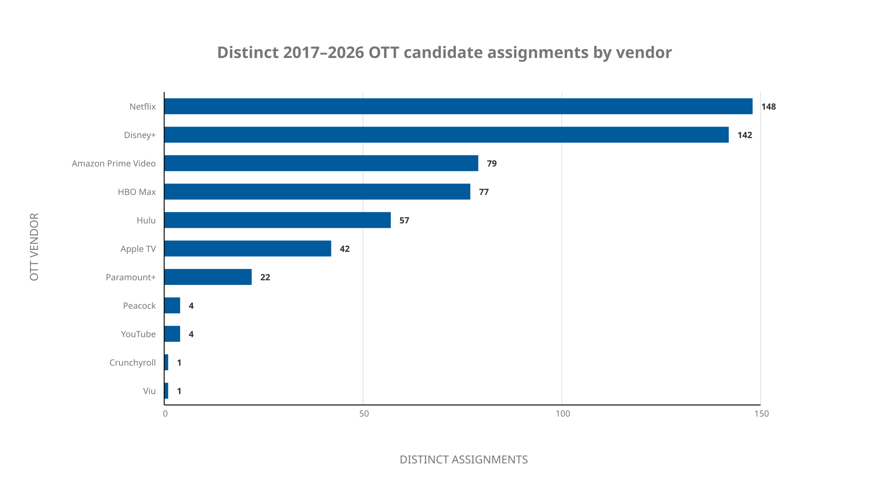

# Distribution, Platforms, Vendors

*Computed: 2026-10-08. Candidate service evidence and corporate affiliation are separate.*

## 1. Introduction and Scope

**Media and entertainment** is the umbrella term for films, television and streaming video, along with the companies that produce, distribute and deliver them. **Production companies** make works; **distributors** arrange releases and licensing; **streaming platforms** deliver video over the internet. A company can fill several roles.

**OTT** means **over-the-top**, a broadcasting term for internet delivery beyond traditional broadcast, cable and satellite channels. [IAB Tech Lab explains its origins](https://iabtechlab.com/ott-vs-ctv-whats-in-a-name/). Here, an **OTT vendor** is a streaming service or service family, such as Netflix, Disney+, HBO Max or Paramount+. This report groups Alpha60 media objects by recorded distribution evidence; the [crosswalk below](#21-normalization-crosswalk) lists the twelve reviewed vendors.

The ten annual inventories contain **652 annual rows** and **650 distinct collection keys**. **500 objects** match at least one approved candidate rule, producing **577 non-exclusive object-vendor assignments** across **11 vendors**. **150 objects** have no approved signal; **0 keys** lack canonical metadata. **73 objects** have multiple candidate vendors.

## 2. Scope and method

Population: pinned 2017–2026 annual measurement inventories, joined by collection key to **685 canonical records**. Cohort years describe sampling, not release years. Each vendor counts each key once across the period; annual rows retain repeat observations. [Inputs and source hashes](../data/mellon-7.8/ott-vendors/runs/20261008-ott-vendors-v1/build-receipt.json) make the freeze reproducible.

Exact canonical distribution tags provide direct platform evidence. The approved Disney content-hub and HBO network-origin supplements retain separate evidence types. All assignments are candidates: they establish neither current availability nor territory, window or exclusivity. Corporate ownership never creates a service assignment.

### 2.1 Normalization crosswalk

The twelve approved direct rows are unchanged. The dated ownership column is additional information. “Not reviewed here” describes the scope of this ownership audit.

| Vendor label | Exact distribution tags | Dated parent affiliation |
| --- | --- | --- |
| Amazon Prime Video | `amazon mgm studios via prime video worldwide`, `amazon prime`, `amazon prime video`, `prime video` | Not reviewed here |
| Apple TV | `apple tv`, `apple+` | Not reviewed here |
| Crunchyroll | `crunchyroll streaming` | Not reviewed here |
| Discovery+ | `discovery+` | Skydance Corporation via WBD, from 2026-10-06 |
| Disney+ | `disney+` | Not reviewed here |
| HBO Max | `hbo max`, `max` | Skydance Corporation via WBD, from 2026-10-06; HBO brand retained |
| Hulu | `fx on hulu`, `hulu`, `hulu united states`, `hulu us` | Not reviewed here |
| Netflix | `netflix`, `netflix international`, `netflix united states` | Not reviewed here |
| Paramount+ | `cbs all access`, `paramount+` | Skydance Corporation (formerly Paramount Skydance Corporation); parent relationship from 2025-08-07, name from 2026-10-06 |
| Peacock | `peacock` | Not reviewed here |
| Viu | `viu as me za` | Not reviewed here |
| YouTube | `youtube premium`, `youtube red`, `youtube tv` | Not reviewed here |

[The SEC closing filing](https://www.sec.gov/Archives/edgar/data/2041610/000110465926113913/tm2626659d7_ex99-2.htm) establishes WBD’s acquisition and the parent’s legal-name continuity. [HBO’s own update](https://help.hbomax.com/me-en/Answer/Detail/000002825) keeps HBO Max and Paramount+ separate and reports no immediate changes to their apps or subscriptions. The FAQ is the Montenegro English edition.

`cbs all access` remains the historical Paramount+ alias; `max` remains an HBO Max alias. Pluto TV has a separate service registry record and no added candidate rule. Generic studio/network tags such as `paramount`, `cbs`, `showtime` and Warner Bros. stay outside the direct service crosswalk.

### 2.2 Disney+ content-hub expansion

Disney's [Disney+ overview](https://en.wikipedia.org/wiki/Disney%2B) identifies
dedicated hubs for Disney, Pixar, Marvel, Star Wars, National Geographic,
ESPN, and Hulu, alongside Disney+ originals and exclusives. For section 4,
the Disney+ candidate slice therefore supplements the unchanged section 2.1
direct-platform crosswalk with the following exact canonical evidence:

| Disney+ hub/group | Accepted canonical evidence |
| --- | --- |
| Disney | `distribution_tags`: `disney`; `production_tags`: `walt disney animation studios`, `walt disney pictures`, `walt disney studios` |
| Pixar | `production_tags`: `pixar animation studios` |
| Marvel / MarvelTV | `production_tags`: `marvel entertainment`, `marvel studios`, `marvel studios animation`, `marvel television`, `marvel television season 1` |
| Star Wars / StarWars | `production_tags`: `lucasfilm`, `lucasfilm animation`, `lucasfilm ltd`, restricted in this cohort to records whose collection identity is a Star Wars work |
| National Geographic | exact `national geographic` tag in `distribution_tags` or `production_tags` |
| ESPN | exact `espn` tag in `distribution_tags` or `production_tags`; applicable only in the United States, Latin America, Caribbean, Australia, New Zealand, and South Africa |
| Hulu | the four unchanged Hulu aliases in section 2.1: `fx on hulu`, `hulu`, `hulu united states`, `hulu us` |
| FX Networks | `distribution_tags`: `fx`, `fx networks`, `fx movie channel`, `fxm`, `fxx`, `fx on hulu`; `production_tags`: `fx`, `fx networks`, `fx productions`, `fxm`, `fxp`, `fxx` |
| Disney+ originals and exclusives | direct `distribution_tags` value `disney+` from section 2.1 |

These remain non-exclusive hub candidates. Hulu creates both Hulu and Disney+ assignments. Lucasfilm requires an explicitly reviewed Star Wars identity; ESPN requires a verified applicable territory. Unverified conditions withhold the conditional candidate and appear in the evidence ledger.

### 2.3 HBO network-brand expansion

Exact `distribution_tags: hbo` retains the network-origin candidate supplement. It adds **55 objects** beyond **22 direct HBO Max matches**, giving **77 distinct candidates**. The `hbo us` tag alone does not pass this exact rule. Network origin and current catalog availability remain separate; the historical Westworld example in the September report illustrates that distinction.

### 2.4 What counts as a USA Production Company?

*Revised 2026-10-08: owner-approved production-company OR commissioner OR platform rule.*

**Netflix Studios, LLC is a USA production company.** Netflix's 2025 annual
report, Exhibit 21.1, identifies it as a United States subsidiary wholly owned
by Netflix, Inc. The same filing lists subsidiaries in other jurisdictions, so
the Netflix brand alone does not identify a particular legal entity.
[Netflix annual report, Exhibit 21.1, PDF page 117](https://d18rn0p25nwr6d.cloudfront.net/CIK-0001065280/99482238-46b2-4d0d-b292-40e6781bdf03.pdf#page=117)

For this analysis, **USA Production is true if a confirmed production company,
commissioner, OR platform is U.S.** Existing confirmed U.S. production-country
evidence also qualifies. This is the project's selection convention; a work
qualifying through its commissioner or platform is not thereby credited to a
U.S. production company.

A **USA Production Company** still means a production company with sourced U.S.
domicile and a confirmed title-specific production relationship. The additional
commissioner/platform branches use sourced U.S. provider classification and a
confirmed title relationship or an exact reviewed network/platform tag with
source provenance. Provider country is separate from the viewer's territory,
filming location, and the work's recorded country of origin. Service-brand
classification does not identify the title's contracting subsidiary.

| Evidence | How it is used |
| --- | --- |
| Confirmed title production/co-production credit and U.S. company domicile | USA Production is true through the producer branch. |
| Confirmed title commissioner and sourced U.S. company/provider classification | USA Production is true through the commissioner branch. |
| Confirmed U.S. platform relationship or exact sourced platform/network tag | USA Production is true through the platform branch, independently of producer domicile. |
| Documented parent ownership | Keep dated ownership and subsidiary domicile separate; ownership alone does not invent a title credit. |
| U.S. distribution territory, filming location, or a generic distributor/studio tag | Not sufficient by itself to establish a U.S. producer, commissioner, or platform. |
| Development-only, executive-producer, or equipment/service-vendor credit | Keep the actual role; it does not automatically establish a qualifying branch. |

Each assessment retains its original country evidence, rule version, qualifying
role/provider, and sources. Unknown or disputed relationships remain explicit.
The exact-tag provider country map is versioned as `config/usa-production-v2.json`
in the metadata repository. It includes reviewed streaming and network
platforms; a network-platform classification does not assign its titles to an
OTT catalog. The section 2.1 vendor aliases and candidate-only service rules
remain distinct from this broader USA Production predicate.

### 2.5 Example: Crew Girl

The following crosswalk explains why Crew Girl requires a company-level review.
It covers the relationships identified so far; a complete end-credit vendor
inventory has not been verified.

| Company or credited party | Relationship to Crew Girl | Evidence and classification |
| --- | --- | --- |
| GPM-CGL Productions Inc. | Named title production entity | The June 9, 2025 [production application](https://northsaanich.ca/wp-content/uploads/2025-06-19-10555-West-Saanich-Rd-TUP-2025-01-ADA.pdf#page=3) names GPM-CGL and Great Pacific Media and describes a Canadian-content production commissioned by Netflix. The application does not establish every entity's legal domicile or ownership. |
| Great Pacific Media | Original production company/brand | The [originating producer's account](https://dominionofdrama.com/crew-girl-hits-the-water/) identifies Great Pacific as the producer, subsequently presented as Blue Ant Studios. Preserve the original credit. |
| Thunderbird Entertainment | Great Pacific's original parent group | Blue Ant's [acquisition announcement](https://blueantmedia.com/2026/01/blue-ant-media-completes-acquisition-of-thunderbird-entertainment/) records the acquisition of Thunderbird on January 28, 2026. This is a dated ownership relationship, not another title production credit. |
| Blue Ant Studios / Blue Ant Media | Current studio presentation and parent group | The [February 4, 2026 reorganization](https://blueantmedia.com/2026/02/blue-ant-media-repositions-blue-ant-studios-unveils-genre-led-structure-and-expanded-rights-capabilities/) retired the Great Pacific brand. Blue Ant's [July 7 title announcement](https://blueantmedia.com/2026/07/netflix-sets-september-10-premiere-date-for-blue-ant-studios-crew-girl/) presents Crew Girl as a Blue Ant Studios production. |
| Netflix | Commissioner, development contracting party, and streaming platform | Commissioning is documented in the [production application](https://northsaanich.ca/wp-content/uploads/2025-06-19-10555-West-Saanich-Rd-TUP-2025-01-ADA.pdf#page=3). [Dominion of Drama](https://dominionofdrama.com/crew-girl-hits-the-water/) describes Netflix contracting Jeff Norton to develop the format and the global Netflix release. These sources identify the brand, not the contracting subsidiary. |
| Netflix Studios, LLC | Confirmed U.S. company; exact title relationship unresolved | [Exhibit 21.1](https://d18rn0p25nwr6d.cloudfront.net/CIK-0001065280/99482238-46b2-4d0d-b292-40e6781bdf03.pdf#page=117) verifies United States jurisdiction and 100% Netflix ownership. The sources above do not name this entity as Crew Girl's producer or contracting party; that open credit question no longer blocks the commissioner/platform branches. |
| Dominion of Drama / Jeff Norton | Originating development and executive producer | The [company's account](https://dominionofdrama.com/crew-girl-hits-the-water/) describes Norton's originating role; [Blue Ant's credits](https://blueantmedia.com/2026/07/netflix-sets-september-10-premiere-date-for-blue-ant-studios-crew-girl/) list him as an executive producer. Preserve the individual credit without inferring a corporate co-production credit. |
| Keslow Camera | Reported camera-equipment vendor; confirmation pending | The earlier crosswalk recorded an [IMDb company-credit listing](https://www.imdb.com/title/tt38218082/companycredits/). Primary credit confirmation remains outstanding; this entry supplies no USA-production eligibility evidence. |

**Crew Girl is USA Production = true under the revised rule.** Its Netflix
commissioning and platform relationships are confirmed in the production
application and title announcement above. Netflix's
[corporate information](https://help.netflix.com/en/node/134094) and
[U.S. company filing](https://www.sec.gov/Archives/edgar/data/1065280/000106528026000034/0001065280-26-000034-index.htm)
support the provider's U.S. classification. Crew Girl therefore qualifies
through Netflix as commissioner/platform, even though its recorded origin is
Canada.

The earlier unresolved issue was narrower: Netflix Studios, LLC is confirmed
as a U.S. company, but its specific producer credit on Crew Girl was not
established. That credit remains unconfirmed. The owner's revised OR rule
resolves Crew Girl's USA Production eligibility without asserting that credit.

The [AAM analysis](https://alpha60-devops.github.io/alpha60-asian-american-media/docs/aam.html)
records the run's selection rule and coverage. The original 190-work stage 2
run used the narrower predicate and remains a historical comparison. The
revised run contains **197 eligible, measured works**, including Crew Girl: seven
additions and no removals. It retains expanded AAPI, Threshold 2, and no
citizenship minimum, with the broader USA Production condition.

Current-parent annotations follow the same separation of roles. HBO and Paramount+ share Skydance affiliation as of October 6, 2026; that relationship adds neither a title producer credit nor an OTT assignment. This ownership update leaves the 197-work AAM selection unchanged.

## 3. Coverage and assignment counts

### 3.1 Media-object-by-year matrix

| Year | Cohort objects | Objects with a vendor | Assignments | Multi-vendor | Unmatched | Missing metadata | Match rate |
| --- | --- | --- | --- | --- | --- | --- | --- |
| 2017 | 44 | 41 | 52 | 9 | 3 | 0 | 93.2% |
| 2018 | 49 | 42 | 51 | 9 | 7 | 0 | 85.7% |
| 2019 | 53 | 41 | 48 | 7 | 12 | 0 | 77.4% |
| 2020 | 52 | 46 | 53 | 7 | 6 | 0 | 88.5% |
| 2021 | 83 | 52 | 58 | 5 | 31 | 0 | 62.7% |
| 2022 | 69 | 58 | 63 | 5 | 11 | 0 | 84.1% |
| 2023 | 71 | 57 | 64 | 7 | 14 | 0 | 80.3% |
| 2024 | 69 | 53 | 61 | 8 | 16 | 0 | 76.8% |
| 2025 | 85 | 61 | 69 | 8 | 24 | 0 | 71.8% |
| 2026 | 77 | 51 | 60 | 8 | 26 | 0 | 66.2% |
| Distinct | 650 | 500 | 577 | 73 | 150 | 0 | 76.9% |

### 3.2 Vendor-by-year matrix

| Vendor | 2017 | 2018 | 2019 | 2020 | 2021 | 2022 | 2023 | 2024 | 2025 | 2026 | Distinct total |
| --- | --- | --- | --- | --- | --- | --- | --- | --- | --- | --- | --- |
| Amazon Prime Video | 11 | 8 | 6 | 8 | 3 | 10 | 11 | 7 | 8 | 7 | 79 |
| Apple TV | 0 | 0 | 0 | 0 | 6 | 3 | 8 | 7 | 10 | 8 | 42 |
| Crunchyroll | 0 | 0 | 0 | 0 | 1 | 0 | 0 | 0 | 0 | 0 | 1 |
| Disney+ | 10 | 8 | 7 | 12 | 18 | 19 | 20 | 17 | 18 | 15 | 142 |
| HBO Max | 6 | 7 | 10 | 8 | 4 | 11 | 8 | 7 | 9 | 7 | 77 |
| Hulu | 4 | 4 | 4 | 4 | 5 | 5 | 7 | 8 | 8 | 8 | 57 |
| Netflix | 14 | 18 | 14 | 17 | 20 | 15 | 9 | 12 | 15 | 14 | 148 |
| Paramount+ | 7 | 6 | 5 | 4 | 0 | 0 | 0 | 0 | 0 | 0 | 22 |
| Peacock | 0 | 0 | 0 | 0 | 0 | 0 | 1 | 3 | 0 | 0 | 4 |
| Viu | 0 | 0 | 0 | 0 | 0 | 0 | 0 | 0 | 0 | 1 | 1 |
| YouTube | 0 | 0 | 2 | 0 | 1 | 0 | 0 | 0 | 1 | 0 | 4 |

### 3.3 Cumulative vendor media objects

Native Izzi horizontal bars use object-vendor assignments. [Chart values](20261008_ott_vendors-assignments.bar-graph.json) and the table above provide the exact counts.

### 3.4 Changes since September

| Computation | Objects | Matched | Assignments | Missing |
| --- | --- | --- | --- | --- |
| September frozen baseline | 644 | 499 | 576 | 1 |
| Current metadata on September inventories | 644 | 500 | 577 | 0 |
| Current metadata and inventories | 650 | 500 | 577 | 0 |

The same rules reproduce September’s 499 matches and 576 assignments exactly. [Every changed object](../data/mellon-7.8/ott-vendors/runs/20261008-ott-vendors-v1/differences.json) records its cause. Rule changes and ownership-only membership changes are both **zero**. Metadata changes are evaluated first, then inventory changes, so their effects are not counted twice.

## 4. Per-vendor candidate slices

<strong>Amazon Prime Video — 79</strong>

- **2017 (11):** `americans-501`, `americans-513`, `expanse-201`, `expanse-203`, `expanse-204`, `expanse-210`, `expanse-213`, `i-love-dick`, `star-trek-discovery-101`, `star-trek-discovery-104`, `star-trek-discovery-109`

- **2018 (8):** `expanse-301`, `expanse-313`, `marvelous-mrs-maisel-02`, `romanoffs-101`, `romanoffs-104`, `romanoffs-108`, `star-trek-discovery-110`, `star-trek-discovery-115`

- **2019 (6):** `expanse-04`, `marvelous-mrs-maisel-03`, `star-trek-discovery-201`, `star-trek-discovery-206`, `star-trek-discovery-214`, `undone-01`

- **2020 (8):** `boys-201`, `boys-208`, `expanse-501`, `star-trek-discovery-305`, `star-trek-lower-decks-101`, `star-trek-picard-110`, `tales-from-the-loop-01`, `upload-01`

- **2021 (3):** `expanse-510`, `invincible-101`, `underground-railroad-01`

- **2022 (10):** `boys-301`, `boys-308`, `boys-presents-diabolical-01`, `marvelous-mrs-maisel-407`, `paper-girls-01`, `peripheral-101`, `peripheral-108`, `rings-of-power-101`, `rings-of-power-108`, `undone-02`

- **2023 (11):** `citadel-101`, `citadel-106`, `consultant-01`, `gen-v-101`, `gen-v-108`, `im-a-virgo-01`, `invincible-201`, `marvelous-mrs-maisel-501`, `power-105`, `power-109`, `reacher-201`

- **2024 (7):** `boys-401`, `fallout-2024-01`, `mr-and-mrs-smith-2024-01`, `outer-range-02`, `reacher-208`, `rings-of-power-201`, `rings-of-power-207`

- **2025 (8):** `ballard-01`, `fallout-2024-201`, `gen-v-201`, `gen-v-206`, `invincible-301`, `reacher-301`, `reacher-307`, `summer-i-turned-pretty-311`

- **2026 (7):** `bluff`, `boys-501`, `fallout-2024-206`, `invincible-401`, `legend-of-vox-machina-410`, `man-on-the-run`, `reacher-401`

<strong>Apple TV — 42</strong>

- **2017 (0):** None

- **2018 (0):** None

- **2019 (0):** None

- **2020 (0):** None

- **2021 (6):** `for-all-mankind-201`, `for-all-mankind-210`, `foundation-101`, `invasion-101`, `me-you-cant-see-01`, `ted-lasso-201`

- **2022 (3):** `for-all-mankind-301`, `prehistoric-planet-01`, `roar-01`

- **2023 (8):** `changeling-108`, `for-all-mankind-401`, `foundation-201`, `hijack-101`, `hijack-107`, `liaison-101`, `monarch-legacy-of-monsters-101`, `prehistoric-planet-02`

- **2024 (7):** `bad-monkey-109`, `for-all-mankind-410`, `masters-of-the-air-101`, `masters-of-the-air-108`, `monarch-legacy-of-monsters-110`, `silo-201`, `sugar-107`

- **2025 (10):** `chief-of-war-101`, `chief-of-war-107`, `dope-thief-101`, `down-cemetery-road-101`, `invasion-301`, `pluribus-107`, `prehistoric-planet-03`, `severance-201`, `severance-209`, `studio-2025-101`

- **2026 (8):** `for-all-mankind-501`, `hijack-201`, `monarch-legacy-of-monsters-201`, `monarch-legacy-of-monsters-208`, `silo-301`, `star-city-101`, `sugar-201`, `widows-bay-108`

<strong>Crunchyroll — 1</strong>

- **2017 (0):** None

- **2018 (0):** None

- **2019 (0):** None

- **2020 (0):** None

- **2021 (1):** `blade-runner-black-lotus-101`

- **2022 (0):** None

- **2023 (0):** None

- **2024 (0):** None

- **2025 (0):** None

- **2026 (0):** None

<strong>Disney+ — 142</strong>

- **2017 (10):** `americans-501`, `americans-513`, `feud-101`, `feud-102`, `feud-108`, `handmaids-tale-101`, `handmaids-tale-105`, `star-wars-last-jedi`, `twin-peaks-310`, `twin-peaks-317`

- **2018 (8):** `american-crime-story-201`, `american-crime-story-205`, `black-panther`, `handmaids-tale-201`, `handmaids-tale-208`, `handmaids-tale-213`, `luke-cage-02`, `orville-201`

- **2019 (7):** `killing-eve-201`, `killing-eve-208`, `mandalorian-101`, `mandalorian-102`, `mandalorian-108`, `orville-206`, `orville-214`

- **2020 (12):** `black-is-king`, `devs-108`, `folklore`, `hamilton`, `happiest-season`, `high-fidelity-01`, `lego-star-wars-holiday-special-2020`, `mandalorian-201`, `mandalorian-208`, `mulan`, `solar-opposites-01`, `what-we-do-in-the-shadows-210`

- **2021 (18):** `archer-1201`, `beatles-get-back`, `falcon-and-the-winter-soldier-101`, `falcon-and-the-winter-soldier-106`, `loki-101`, `loki-106`, `mother-android`, `only-murders-in-the-building-110`, `pose-307`, `raya-and-the-last-dragon`, `reservation-dogs-101`, `shang-chi-and-the-legend-of-the-ten-rings`, `star-wars-visions-01`, `summer-of-soul`, `wandavision-101`, `wandavision-109`, `what-if-2021-101`, `y-the-last-man-101`

- **2022 (19):** `andor-101`, `andor-112`, `archer-1308`, `atlanta-301`, `atlanta-310`, `atlanta-410`, `book-of-boba-fett-107`, `eternals`, `kindred-01`, `obi-wan-kenobi-101`, `obi-wan-kenobi-106`, `old-man-107`, `only-murders-in-the-building-201`, `only-murders-in-the-building-210`, `prey`, `reservation-dogs-201`, `spider-man-no-way-home`, `tales-of-the-jedi-01`, `turning-red`

- **2023 (20):** `ahsoka-101`, `ahsoka-108`, `american-born-chinese-01`, `archer-1401`, `archer-1408`, `bear-02`, `black-panther-wakanda-forever`, `fargo-501`, `guardians-of-the-galaxy-3`, `loki-201`, `loki-206`, `mandalorian-301`, `mandalorian-308`, `murder-at-the-end-of-the-world-101`, `murder-at-the-end-of-the-world-107`, `only-murders-in-the-building-301`, `only-murders-in-the-building-310`, `reservation-dogs-301`, `reservation-dogs-310`, `spider-man-across-the-spider-verse`

- **2024 (17):** `acolyte-101`, `acolyte-107`, `agatha-all-along-101`, `agatha-all-along-107`, `bear-03`, `echo-01`, `fargo-510`, `feud-02`, `hit-monkey-02`, `inside-out-2`, `interior-chinatown-01`, `old-man-201`, `only-murders-in-the-building-401`, `only-murders-in-the-building-409`, `shogun-2024-101`, `shogun-2024-110`, `what-if-2021-03`

- **2025 (18):** `alien-earth-101`, `alien-earth-106`, `andor-112`, `andor-201`, `andor-210`, `bear-04`, `eyes-of-wakanda-01`, `ironheart-01`, `lowdown-101`, `mid-century-modern-01`, `moana-2`, `only-murders-in-the-building-501`, `only-murders-in-the-building-508`, `predator-killer-of-killers`, `sly-lives`, `star-wars-visions-03`, `tron-ares`, `your-friendly-neighborhood-spider-man-01`

- **2026 (15):** `acolyte-107`, `bear-00`, `bear-05`, `beauty-108`, `hoppers`, `love-story-2026-107`, `mandalorian-and-grogu`, `maul-shadow-lord-101`, `season-2026-01`, `shards-101`, `star-wars-visions-the-ninth-jedi-01`, `testaments-101`, `toy-story-5`, `x-men-97-201`, `zootopia-2`

<strong>HBO Max — 77</strong>

- **2017 (6):** `game-of-thrones-701`, `game-of-thrones-702`, `game-of-thrones-703`, `game-of-thrones-705`, `game-of-thrones-706`, `game-of-thrones-707`

- **2018 (7):** `random-acts-of-flyness-104`, `random-acts-of-flyness-106`, `westworld-201`, `westworld-203`, `westworld-205`, `westworld-207`, `westworld-210`

- **2019 (10):** `big-little-lies-201`, `big-little-lies-207`, `game-of-thrones-801`, `game-of-thrones-803`, `game-of-thrones-806`, `succession-210`, `true-detective-301`, `true-detective-308`, `watchmen-104`, `watchmen-109`

- **2020 (8):** `avenue-5-101`, `doom-patrol-201`, `euphoria-special`, `lovecraft-country-101`, `lovecraft-country-110`, `raised-by-wolves-110`, `westworld-301`, `westworld-308`

- **2021 (4):** `doom-patrol-301`, `kung-fu-101`, `made-for-love-107`, `succession-301`

- **2022 (11):** `euphoria-208`, `flight-attendant-201`, `house-of-the-dragon-101`, `house-of-the-dragon-103`, `house-of-the-dragon-110`, `raised-by-wolves-201`, `raised-by-wolves-208`, `station-eleven-110`, `tokyo-vice-01`, `westworld-401`, `westworld-408`

- **2023 (8):** `and-just-like-that-201`, `and-just-like-that-211`, `barry-401`, `full-circle-01`, `idol-101`, `last-of-us-101`, `last-of-us-109`, `minx-02`

- **2024 (7):** `fantasmas-01`, `house-of-the-dragon-201`, `house-of-the-dragon-207`, `penguin-101`, `penguin-107`, `tokyo-vice-201`, `tokyo-vice-209`

- **2025 (9):** `duster-101`, `duster-106`, `hacks-401`, `hacks-408`, `last-of-us-201`, `last-of-us-206`, `peacemaker-201`, `white-lotus-301`, `white-lotus-307`

- **2026 (7):** `euphoria-301`, `house-of-the-dragon-301`, `house-of-the-dragon-308`, `knight-of-the-seven-kingdoms-106`, `lanterns-101`, `pitt-201`, `pitt-213`

<strong>Hulu — 57</strong>

- **2017 (4):** `handmaids-tale-101`, `handmaids-tale-105`, `twin-peaks-310`, `twin-peaks-317`

- **2018 (4):** `handmaids-tale-201`, `handmaids-tale-208`, `handmaids-tale-213`, `orville-201`

- **2019 (4):** `killing-eve-201`, `killing-eve-208`, `orville-206`, `orville-214`

- **2020 (4):** `devs-108`, `happiest-season`, `high-fidelity-01`, `solar-opposites-01`

- **2021 (5):** `mother-android`, `only-murders-in-the-building-110`, `reservation-dogs-101`, `summer-of-soul`, `y-the-last-man-101`

- **2022 (5):** `kindred-01`, `only-murders-in-the-building-201`, `only-murders-in-the-building-210`, `prey`, `reservation-dogs-201`

- **2023 (7):** `bear-02`, `murder-at-the-end-of-the-world-101`, `murder-at-the-end-of-the-world-107`, `only-murders-in-the-building-301`, `only-murders-in-the-building-310`, `reservation-dogs-301`, `reservation-dogs-310`

- **2024 (8):** `bear-03`, `echo-01`, `hit-monkey-02`, `interior-chinatown-01`, `only-murders-in-the-building-401`, `only-murders-in-the-building-409`, `shogun-2024-101`, `shogun-2024-110`

- **2025 (8):** `alien-earth-101`, `alien-earth-106`, `bear-04`, `mid-century-modern-01`, `only-murders-in-the-building-501`, `only-murders-in-the-building-508`, `predator-killer-of-killers`, `sly-lives`

- **2026 (8):** `bear-00`, `bear-05`, `beauty-108`, `love-story-2026-107`, `season-2026-01`, `shards-101`, `star-wars-visions-the-ninth-jedi-01`, `testaments-101`

<strong>Netflix — 148</strong>

- **2017 (14):** `el-chapo-02`, `house-of-cards-05`, `into-the-badlands-203`, `narcos-03`, `sense8-02.1`, `stranger-things-02`, `twin-peaks-310`, `twin-peaks-317`, `walking-dead-709`, `walking-dead-710`, `walking-dead-713`, `walking-dead-716`, `walking-dead-801`, `walking-dead-807`

- **2018 (18):** `3-percent-02`, `altered-carbon-01`, `american-crime-story-201`, `american-crime-story-205`, `better-call-saul-406`, `chilling-adventures-of-sabrina-01`, `glow-02`, `house-of-cards-06`, `into-the-badlands-308`, `luke-cage-02`, `maniac-01`, `narcos-mexico-01`, `orange-is-the-new-black-06`, `ozark-02`, `sense8-02.2`, `walking-dead-811`, `walking-dead-816`, `walking-dead-908`

- **2019 (14):** `dolemite-is-my-name`, `glow-03`, `high-flying-bird`, `love-death-robots-01`, `oa-02`, `orange-is-the-new-black-07`, `queer-eye-2018-04`, `she-ra-04`, `stranger-things-03`, `tales-of-the-city-2019`, `umbrella-academy-01`, `walking-dead-1008`, `walking-dead-916`, `wu-assassins-01`

- **2020 (17):** `altered-carbon-02`, `altered-carbon-resleeved`, `away-01`, `biohackers-01`, `blackaf-01`, `bojack-horseman-06`, `control-z-01`, `da-5-bloods`, `dark-03`, `jamtara-sabka-number-ayega`, `japan-sinks`, `lovebirds`, `narcos-mexico-02`, `queer-eye-2018-05`, `space-force-01`, `tiger-king-and-i`, `umbrella-academy-02`

- **2021 (20):** `army-of-the-dead`, `cowboy-bebop-2021-01`, `dont-look-up`, `halston-01`, `harder-they-fall`, `love-death-robots-02`, `lupin-02`, `malcolm-and-marie`, `mitchells-vs-the-machines`, `mother-android`, `narcos-mexico-03`, `outer-banks-02`, `outside-the-wire`, `princess-switch-3`, `q-force-01`, `shadow-and-bone-01`, `space-sweepers`, `trese-01`, `witcher-02`, `yasuke-01`

- **2022 (15):** `all-of-us-are-dead-01`, `andy-warhol-diaries-01`, `bridgerton-02`, `enola-holmes-2`, `fistful-of-vengeance`, `glass-onion`, `gray-man`, `inventing-anna-01`, `jeen-yuhs-01`, `russian-doll-02`, `sandman-01`, `stranger-things-04.1`, `stranger-things-04.2`, `wednesday-01`, `witcher-blood-origin-01`

- **2023 (9):** `blue-eye-samurai-01`, `fubar-01`, `lupin-03`, `outer-banks-03`, `queen-charlotte-01`, `queer-eye-2018-07`, `they-cloned-tyrone`, `witcher-03.1`, `witcher-03.2`

- **2024 (12):** `3-body-problem-01`, `arcane-02.1`, `arcane-02.2`, `arcane-02.3`, `avatar-the-last-airbender-2024-01`, `beverly-hills-cop-axel-f`, `brothers-sun-01`, `diplomat-02`, `griselda-01`, `hit-man`, `madness-01`, `squid-game-02`

- **2025 (15):** `american-primeval`, `death-by-lightning`, `frankenstein-2025`, `long-story-short-01`, `love-death-robots-04`, `night-agent-02`, `nouvelle-vague`, `sean-combs-the-reckoning`, `squid-game-03`, `stranger-things-05.1`, `stranger-things-05.2`, `wednesday-02.1`, `wednesday-02.2`, `witcher-04`, `zero-day-01`

- **2026 (14):** `avatar-the-last-airbender-2024-02`, `beef-02`, `bridgerton-04.1`, `bridgerton-04.2`, `dang-01`, `dinosaurs-01`, `enola-holmes-3`, `his-and-hers-2026-01`, `mating-season-01`, `my-brilliant-career-2026-01`, `night-agent-03`, `one-piece-2023-02`, `stranger-things-05.3`, `stranger-things-tales-from-85-01`

<strong>Paramount+ — 22</strong>

- **2017 (7):** `good-fight-101`, `good-fight-105`, `good-fight-108`, `good-fight-110`, `star-trek-discovery-101`, `star-trek-discovery-104`, `star-trek-discovery-109`

- **2018 (6):** `good-fight-202`, `good-fight-205`, `good-fight-210`, `good-fight-213`, `star-trek-discovery-110`, `star-trek-discovery-115`

- **2019 (5):** `good-fight-301`, `good-fight-310`, `star-trek-discovery-201`, `star-trek-discovery-206`, `star-trek-discovery-214`

- **2020 (4):** `good-fight-407`, `star-trek-discovery-305`, `star-trek-lower-decks-101`, `star-trek-picard-110`

- **2021 (0):** None

- **2022 (0):** None

- **2023 (0):** None

- **2024 (0):** None

- **2025 (0):** None

- **2026 (0):** None

<strong>Peacock — 4</strong>

- **2017 (0):** None

- **2018 (0):** None

- **2019 (0):** None

- **2020 (0):** None

- **2021 (0):** None

- **2022 (0):** None

- **2023 (1):** `twisted-metal-01`

- **2024 (3):** `killer-2024`, `laid-01`, `stormy`

- **2025 (0):** None

- **2026 (0):** None

<strong>Viu — 1</strong>

- **2017 (0):** None

- **2018 (0):** None

- **2019 (0):** None

- **2020 (0):** None

- **2021 (0):** None

- **2022 (0):** None

- **2023 (0):** None

- **2024 (0):** None

- **2025 (0):** None

- **2026 (1):** `season-2026-01`

<strong>YouTube — 4</strong>

- **2017 (0):** None

- **2018 (0):** None

- **2019 (2):** `cobra-kai-02`, `kurulus-osman-01`

- **2020 (0):** None

- **2021 (1):** `cobra-kai-03`

- **2022 (0):** None

- **2023 (0):** None

- **2024 (0):** None

- **2025 (1):** `cobra-kai-06.3`

- **2026 (0):** None

## 5. Multi-vendor overlaps

These are retained non-exclusive matches. The same key contributes once to each vendor and once to the matched-object union.

| Collection key | Candidate vendors |
| --- | --- |
| `alien-earth-101` | Disney+, Hulu |
| `alien-earth-106` | Disney+, Hulu |
| `american-crime-story-201` | Disney+, Netflix |
| `american-crime-story-205` | Disney+, Netflix |
| `americans-501` | Amazon Prime Video, Disney+ |
| `americans-513` | Amazon Prime Video, Disney+ |
| `bear-00` | Disney+, Hulu |
| `bear-02` | Disney+, Hulu |
| `bear-03` | Disney+, Hulu |
| `bear-04` | Disney+, Hulu |
| `bear-05` | Disney+, Hulu |
| `beauty-108` | Disney+, Hulu |
| `devs-108` | Disney+, Hulu |
| `echo-01` | Disney+, Hulu |
| `handmaids-tale-101` | Disney+, Hulu |
| `handmaids-tale-105` | Disney+, Hulu |
| `handmaids-tale-201` | Disney+, Hulu |
| `handmaids-tale-208` | Disney+, Hulu |
| `handmaids-tale-213` | Disney+, Hulu |
| `happiest-season` | Disney+, Hulu |
| `high-fidelity-01` | Disney+, Hulu |
| `hit-monkey-02` | Disney+, Hulu |
| `interior-chinatown-01` | Disney+, Hulu |
| `killing-eve-201` | Disney+, Hulu |
| `killing-eve-208` | Disney+, Hulu |
| `kindred-01` | Disney+, Hulu |
| `love-story-2026-107` | Disney+, Hulu |
| `luke-cage-02` | Disney+, Netflix |
| `mid-century-modern-01` | Disney+, Hulu |
| `mother-android` | Disney+, Hulu, Netflix |
| `murder-at-the-end-of-the-world-101` | Disney+, Hulu |
| `murder-at-the-end-of-the-world-107` | Disney+, Hulu |
| `only-murders-in-the-building-110` | Disney+, Hulu |
| `only-murders-in-the-building-201` | Disney+, Hulu |
| `only-murders-in-the-building-210` | Disney+, Hulu |
| `only-murders-in-the-building-301` | Disney+, Hulu |
| `only-murders-in-the-building-310` | Disney+, Hulu |
| `only-murders-in-the-building-401` | Disney+, Hulu |
| `only-murders-in-the-building-409` | Disney+, Hulu |
| `only-murders-in-the-building-501` | Disney+, Hulu |
| `only-murders-in-the-building-508` | Disney+, Hulu |
| `orville-201` | Disney+, Hulu |
| `orville-206` | Disney+, Hulu |
| `orville-214` | Disney+, Hulu |
| `predator-killer-of-killers` | Disney+, Hulu |
| `prey` | Disney+, Hulu |
| `reservation-dogs-101` | Disney+, Hulu |
| `reservation-dogs-201` | Disney+, Hulu |
| `reservation-dogs-301` | Disney+, Hulu |
| `reservation-dogs-310` | Disney+, Hulu |
| `season-2026-01` | Disney+, Hulu, Viu |
| `shards-101` | Disney+, Hulu |
| `shogun-2024-101` | Disney+, Hulu |
| `shogun-2024-110` | Disney+, Hulu |
| `sly-lives` | Disney+, Hulu |
| `solar-opposites-01` | Disney+, Hulu |
| `star-trek-discovery-101` | Amazon Prime Video, Paramount+ |
| `star-trek-discovery-104` | Amazon Prime Video, Paramount+ |
| `star-trek-discovery-109` | Amazon Prime Video, Paramount+ |
| `star-trek-discovery-110` | Amazon Prime Video, Paramount+ |
| `star-trek-discovery-115` | Amazon Prime Video, Paramount+ |
| `star-trek-discovery-201` | Amazon Prime Video, Paramount+ |
| `star-trek-discovery-206` | Amazon Prime Video, Paramount+ |
| `star-trek-discovery-214` | Amazon Prime Video, Paramount+ |
| `star-trek-discovery-305` | Amazon Prime Video, Paramount+ |
| `star-trek-lower-decks-101` | Amazon Prime Video, Paramount+ |
| `star-trek-picard-110` | Amazon Prime Video, Paramount+ |
| `star-wars-visions-the-ninth-jedi-01` | Disney+, Hulu |
| `summer-of-soul` | Disney+, Hulu |
| `testaments-101` | Disney+, Hulu |
| `twin-peaks-310` | Disney+, Hulu, Netflix |
| `twin-peaks-317` | Disney+, Hulu, Netflix |
| `y-the-last-man-101` | Disney+, Hulu |

## 6. Unmatched and blocked rows

No corporate-family tag is promoted to OTT availability. The complete unmatched ledger follows; conditional failures and their evidence are also downloadable. Missing metadata and absence of a candidate signal are separate dispositions.

**Legacy-tag coverage gap:** 16 cohort objects lack both production and distribution tags. They remain in the population and the [coverage-gap ledger](../data/mellon-7.8/ott-vendors/runs/20261008-ott-vendors-v1/tag-coverage-gaps.json). Crew Girl has confirmed Netflix commissioner/platform relationships in structured metadata, but this report’s frozen exact-tag rules do not read those relationships. Its unmatched row therefore does not deny Netflix availability or undo its USA Production/AAM qualification. Extending this report to structured relationships requires a separately versioned membership rule.

| Collection key | Disposition | Distribution tags |
| --- | --- | --- |
| `abbott-elementary-113` | no-approved-signal | abc |
| `alienist-201` | no-approved-signal | tnt, warner bros television distribution |
| `all-the-old-knives` | no-approved-signal | amazon studios |
| `all-you-need-is-kill` | no-approved-signal | warner bros pictures |
| `american-fiction` | no-approved-signal | orion pictures, through, amazon mgm studios |
| `american-revolution-2025` | no-approved-signal | pbs |
| `anora` | no-approved-signal | neon united states and canada, focus features international |
| `apprentice-2024` | no-approved-signal | mongrel media canada, studiocanal ireland, nordisk film denmark, rich spirit, briarcliff entertainment united states |
| `avatar-the-way-of-water` | no-approved-signal | 20th century studios |
| `bachelors-23-and-01` | no-approved-signal | abc |
| `backrooms-2026` | no-approved-signal | a24 |
| `barbie` | no-approved-signal | warner bros pictures |
| `beacon-23-101` | no-approved-signal | mgm |
| `beacon-23-108` | no-approved-signal | mgm |
| `beastars-03.2` | no-approved-signal; missing legacy tags | None |
| `beatles-anthology` | no-approved-signal | abc, united states |
| `big-bang-theory-1223` | no-approved-signal | cbs |
| `black-bag-2025` | no-approved-signal | focus features united states, universal pictures international |
| `black-mirror-06` | no-approved-signal | channel 4 |
| `black-monday-106` | no-approved-signal | showtime |
| `black-monday-110` | no-approved-signal | showtime |
| `black-monday-310` | no-approved-signal | showtime |
| `blade-runner-2049` | no-approved-signal | warner bros pictures united states and canada, sony pictures releasing international international |
| `blink-twice` | no-approved-signal | amazon mgm studios united states, warner bros pictures international |
| `bliss` | no-approved-signal | amazon studios |
| `borats-american-lockdown` | no-approved-signal; missing legacy tags | None |
| `boy-and-the-heron` | no-approved-signal | toho |
| `brothers-01` | no-approved-signal; missing legacy tags | None |
| `cinderella-2021` | no-approved-signal | amazon studios |
| `cocaine-cowboys-the-kings-of-miami` | no-approved-signal | None |
| `coming-2-america` | no-approved-signal | amazon studios |
| `common-side-effects-01` | no-approved-signal | adult swim |
| `companion-2025` | no-approved-signal | warner bros pictures |
| `coyote-vs-acme` | no-approved-signal; missing legacy tags | None |
| `crew-girl-01` | no-approved-signal; missing legacy tags | None |
| `curse-01` | no-approved-signal | showtime |
| `dan-da-dan-210` | no-approved-signal | mbs, tbs |
| `dark-winds-301` | no-approved-signal | amc |
| `dark-winds-401` | no-approved-signal | amc |
| `debris-113` | no-approved-signal | nbcuniversal television distribution, nbc |
| `demon-slayer-kimetsu-no-yaiba-the-movie-infinity-castle` | no-approved-signal | aniplex toho japan, crunchyroll through sony pictures releasing worldwide |
| `demon-slayer-kimetsu-no-yaiba-the-movie-mugen-train` | no-approved-signal | aniplex, toho |
| `detective-chinatown-3` | no-approved-signal | wanda pictures, warner bros pictures |
| `doctor-who-1101` | no-approved-signal | bbc studios, bbc one |
| `doctor-who-1105` | no-approved-signal | bbc studios, bbc one |
| `doctor-who-1200` | no-approved-signal | bbc studios, bbc one |
| `doors` | no-approved-signal | bloody disgusting |
| `drama-2026` | no-approved-signal | a24 |
| `dune-2021` | no-approved-signal | warner bros pictures |
| `dune-2024` | no-approved-signal | warner bros pictures |
| `dungeons-and-dragons-honor-among-thieves` | no-approved-signal | paramount pictures select territories, entertainment one united kingdom, sam film iceland |
| `emilia-perez` | no-approved-signal | pathe distribution |
| `everything-everywhere-all-at-once` | no-approved-signal | a24 |
| `expanse-601` | no-approved-signal | syfy |
| `expanse-606` | no-approved-signal | syfy |
| `ferhat-ile-sirin` | no-approved-signal; missing legacy tags | None |
| `furious-2025` | no-approved-signal | edko films hong kong, lionsgate films international |
| `ghost-in-the-shell-2026-01` | no-approved-signal | fns, kansai tv, fuji tv, channel neco, kry, animax |
| `goat-2026` | no-approved-signal | sony pictures releasing |
| `godzilla-minus-one` | no-approved-signal | toho |
| `godzilla-vs-kong` | no-approved-signal | warner bros pictures worldwide, toho towa japan |
| `godzilla-x-kong-the-new-empire` | no-approved-signal | warner bros pictures worldwide, toho japan |
| `good-fight-510` | no-approved-signal | paramount |
| `harley-quinn-301` | no-approved-signal | dc universe |
| `highest-2-lowest` | no-approved-signal | a24, apple original films |
| `human-flow` | no-approved-signal | nfp marketing distribution germany, lionsgate, international |
| `i-am-the-night-103` | no-approved-signal | tnt |
| `i-am-the-night-106` | no-approved-signal | tnt |
| `industry-401` | no-approved-signal | bbc uk, hbo us |
| `intergalactic-01` | no-approved-signal | sky one |
| `invite-2026` | no-approved-signal | a24 |
| `kimi` | no-approved-signal | warner bros pictures |
| `king-of-the-hill-14` | no-approved-signal | fox |
| `kingdom-of-the-planet-of-the-apes` | no-approved-signal | 20th century studios |
| `kung-fu-113` | no-approved-signal | the cw |
| `lazarus-101` | no-approved-signal | tv tokyo jp, adult swim us |
| `lazarus-108` | no-approved-signal | tv tokyo jp, adult swim us |
| `lazarus-111` | no-approved-signal | tv tokyo jp, adult swim us |
| `legend-of-aang-the-last-airbender` | no-approved-signal | paramount |
| `legend-of-galactic-heroes-die-neue-these` | no-approved-signal | family gekijo, tokyo mx, mbs, bs11 |
| `lego-star-wars-the-mandalorian-2026` | no-approved-signal; missing legacy tags | None |
| `magic-mikes-last-dance` | no-approved-signal | warner bros pictures |
| `matrix-resurrections` | no-approved-signal | warner bros pictures |
| `mickey-17` | no-approved-signal | warner bros pictures |
| `minecraft-movie-2025` | no-approved-signal | warner bros pictures |
| `money-heist-05.1` | no-approved-signal | antena 3 |
| `money-heist-05.2` | no-approved-signal | antena 3 |
| `monsieur-spade-01` | no-approved-signal | amc, us, canal, france |
| `neagley-01` | no-approved-signal; missing legacy tags | None |
| `no-more-bets` | no-approved-signal | None |
| `no-sudden-move` | no-approved-signal | warner bros pictures |
| `no-time-to-die` | no-approved-signal | united artists releasing united states, universal pictures international |
| `obsession-2025` | no-approved-signal | focus features united states, universal pictures international |
| `olympics-2026` | no-approved-signal; missing legacy tags | None |
| `one-battle-after-another` | no-approved-signal | warner bros pictures |
| `one-night-in-miami` | no-approved-signal | amazon studios |
| `one-piece-95x` | no-approved-signal | fuji television |
| `one-piece-98x` | no-approved-signal | fuji television |
| `oppenheimer` | no-approved-signal | universal pictures |
| `oprah-meghan-harry` | no-approved-signal | cbs |
| `pacific-rim-the-black` | no-approved-signal; missing legacy tags | None |
| `pantheon-108` | no-approved-signal | amc |
| `permanent-record` | no-approved-signal; missing legacy tags | None |
| `polite-society` | no-approved-signal | universal pictures |
| `predator-badlands` | no-approved-signal | 20th century studios |
| `president-curtis-01` | no-approved-signal | adult swim |
| `prisoners-of-the-ghostland` | no-approved-signal | elysian film group, rlje films |
| `project-hail-mary` | no-approved-signal | amazon mgm studios united states and canada, sony pictures releasing international international |
| `queen-of-the-south-301` | no-approved-signal | usa network |
| `queen-of-the-south-311` | no-approved-signal | usa network |
| `queen-of-the-south-313` | no-approved-signal | usa network |
| `queen-of-the-south-407` | no-approved-signal | usa network |
| `queen-of-the-south-413` | no-approved-signal | usa network |
| `queen-of-the-south-510` | no-approved-signal | usa network |
| `renaissance` | no-approved-signal | pathe distribution |
| `rick-and-morty-901` | no-approved-signal | adult swim |
| `road-house-2024` | no-approved-signal | amazon mgm studios |
| `screeners` | no-approved-signal; missing legacy tags | None |
| `send-help` | no-approved-signal | 20th century studios |
| `sinners-2025` | no-approved-signal | warner bros pictures |
| `slow-horses-601` | no-approved-signal; missing legacy tags | None |
| `snowpiercer-209` | no-approved-signal | tnt |
| `snowpiercer-401` | no-approved-signal | tnt |
| `songbird` | no-approved-signal | stxfilms |
| `south-park-27` | no-approved-signal | comedy central, paramount |
| `special-ops-lioness-201` | no-approved-signal | paramount |
| `spider-noir-01` | no-approved-signal | mgm |
| `stormy-daniels-2017` | no-approved-signal; missing legacy tags | None |
| `suicide-squad-2021` | no-approved-signal | warner bros pictures |
| `super-mario-brothers-movie` | no-approved-signal | universal pictures |
| `super-mario-galaxy-movie` | no-approved-signal | universal pictures |
| `superman-2025` | no-approved-signal | warner bros pictures |
| `tenet` | no-approved-signal | warner bros pictures |
| `tomorrow-war` | no-approved-signal | amazon studios |
| `ultra-city-smiths-106` | no-approved-signal; missing legacy tags | None |
| `vanguard` | no-approved-signal | golden screen cinemas |
| `walking-dead-1124` | no-approved-signal | amc |
| `warrior-310` | no-approved-signal | cinemax |
| `we-are-lady-parts-02` | no-approved-signal | channel 4 |
| `weapons-2025` | no-approved-signal | warner bros pictures |
| `wicked-2024` | no-approved-signal | universal pictures |
| `wicked-for-good-2025` | no-approved-signal | universal pictures |
| `wild-robot` | no-approved-signal | universal pictures |
| `wonder-woman-1984` | no-approved-signal | warner bros pictures |
| `world-cup-2026` | no-approved-signal; missing legacy tags | None |
| `yellowjackets-110` | no-approved-signal | showtime |
| `yellowjackets-201` | no-approved-signal | showtime |
| `yellowstone-210` | no-approved-signal | paramount network |
| `yellowstone-505` | no-approved-signal | paramount network |
| `you-04.2` | no-approved-signal | lifetime |

## 7. Review status and remaining gates

*Updated: 2026-10-08 — see [USA Production Company criteria and the Crew Girl crosswalk](#24-what-counts-as-a-usa-production-company). Vendor counts and inventories now reflect the October 8, 2026 computation. The [September 2026 snapshot](20260915_metadata_v7.3_ott_vendors.html) remains available for comparison.*

*Status: the Wikipedia [Streaming platforms](https://en.wikipedia.org/wiki/Over-the-top_media_service#Streaming_platforms) list, the section 2.1 normalization crosswalk, the section 2.2 Disney+ content-hub expansion including the FX Networks family, and the section 2.3 HBO network-brand expansion were approved by human review on 2026-09-13; platform membership remains candidate-only, and no canonical metadata is changed by this document.*

### 7.1 Ownership review and remaining evidence gaps

The expanded asset review covers **67 exact field/tag pairs** across **190 canonical objects**, including objects outside the annual cohorts. Every candidate has an explicit disposition in the [tag review](../data/mellon-7.8/ott-vendors/runs/20261008-ott-vendors-v1/affiliation-tags.json) and [object audit](../data/mellon-7.8/ott-vendors/runs/20261008-ott-vendors-v1/affiliation-audit.json). Generic tags identify brand families where supported; this is not a complete legal-operator register. Unknown historical periods remain unknown.

| Current Skydance affiliation measure | Distinct cohort objects |
| --- | --- |
| service backed | 44 |
| studio or network backed | 169 |
| partial interest | 1 |
| nonpartial union | 181 |

The nonpartial union deduplicates service-backed and studio/network-backed evidence. It is a corporate-affiliation measure, not a streaming slice or a full-control claim. Partial interests are reported separately. Miramax retains Paramount’s 49% interest and beIN’s 51%; SkyShowtime remains a joint venture with Comcast, with its share unspecified by the cited current source.

The Japanese `tbs` tag on DAN DA DAN is excluded from U.S. TBS affiliation. Regional or discontinued entities, ambiguous tags, and incomplete subsidiary histories remain unresolved below. They neither gain a parent annotation nor a streaming assignment.

All3Media International is excluded following the [May 16, 2024 divestiture](https://www.globenewswire.com/news-release/2024/05/16/2883615/0/en/RedBird-IMI-Completes-Acquisition-of-Global-Production-Company-All3Media.html). The CW requires current minority-interest evidence: [Nexstar reports 81.1% as of June 30, 2026](https://www.sec.gov/Archives/edgar/data/1142417/000119312526339827/R10.htm), so historical WBD/Paramount percentages are not carried forward.

| Field | Exact tag | Disposition |
| --- | --- | --- |
| distribution_tags | `cinemax` | unresolved-specific-entity-history |
| distribution_tags | `dc universe` | unresolved-specific-entity-history |
| distribution_tags | `tbs` | excluded-unrelated-entity |
| distribution_tags | `the cw` | unresolved-current-minority-interests |
| distribution_tags | `warnermedia direct` | unresolved-specific-entity-history |
| production_tags | `all3media international` | excluded-divested-family |
| production_tags | `alloy entertainment` | unresolved-specific-entity-history |
| production_tags | `avatar studios` | unresolved-specific-entity-history |
| production_tags | `comedy partners` | unresolved-specific-entity-history |
| production_tags | `paramount television` | unresolved-specific-entity-history |
| production_tags | `paramount television studios` | unresolved-specific-entity-history |
| production_tags | `south park studios` | unresolved-specific-entity-history |
| production_tags | `spelling television` | unresolved-specific-entity-history |
| production_tags | `studio t` | unresolved-specific-entity-history |
| production_tags | `warner bros japan` | unresolved-specific-entity-history |
| production_tags | `warner horizon television seasons 12` | unresolved-specific-entity-history |
| production_tags | `williams street` | unresolved-specific-entity-history |

The affiliation audit provides two queries for each affected object: its actual sample-start date when recorded, and 2026-10-08. Missing sample dates are explicit. Ownership periods are start-inclusive and end-exclusive; an evidence-start date is not a claim that the entity was acquired on that date. Original production/distribution tags are unchanged.

## 8. Data and references

[Objects CSV](../data/mellon-7.8/ott-vendors/runs/20261008-ott-vendors-v1/objects.csv), [objects and rule evidence JSON](../data/mellon-7.8/ott-vendors/runs/20261008-ott-vendors-v1/objects.json), [overlaps](../data/mellon-7.8/ott-vendors/runs/20261008-ott-vendors-v1/overlaps.json), [unmatched](../data/mellon-7.8/ott-vendors/runs/20261008-ott-vendors-v1/unmatched.json), [tables](../data/mellon-7.8/ott-vendors/runs/20261008-ott-vendors-v1/tables.json), [executable crosswalk](../data/mellon-7.8/ott-vendors/runs/20261008-ott-vendors-v1/crosswalk.json), [dated organization registry](../data/mellon-7.8/ott-vendors/runs/20261008-ott-vendors-v1/organizations.json), [parent unions](../data/mellon-7.8/ott-vendors/runs/20261008-ott-vendors-v1/parent-unions.json), [build receipt](../data/mellon-7.8/ott-vendors/runs/20261008-ott-vendors-v1/build-receipt.json), and [validation receipt](../data/mellon-7.8/ott-vendors/runs/20261008-ott-vendors-v1/validation.json).

- [Official October 6 closing announcement](https://ir.paramount.com/news-releases/news-release-details/paramount-completes-acquisition-warner-bros-discovery-creating).

- [HBO’s own update](https://help.hbomax.com/me-en/Answer/Detail/000002825).

- [SEC closing and corporate continuity](https://www.sec.gov/Archives/edgar/data/2041610/000110465926113913/tm2626659d7_ex99-2.htm).

- [2025 Paramount combination](https://ir.paramount.com/node/71726/pdf), [2022 WBD closing](https://www.wbd.com/discovery-and-att-close-warnermedia-transaction/), [2026 WBD portfolio](https://ir.wbd.com/news-and-events/financial-news/financial-news-details/2026/Warner-Bros--Discovery-Reports-Second-Quarter-2026-Results/default.aspx).

- [Miramax interests](https://ir.paramount.com/news-releases/news-release-details/viacomcbs-and-bein-media-group-complete-miramax-transaction/) and [SkyShowtime’s own description](https://corporate.skyshowtime.com/en/about/).

- [Skydance overview](https://en.wikipedia.org/wiki/Skydance_Corporation), [acquisition chronology](https://en.wikipedia.org/wiki/Acquisition_of_Warner_Bros._Discovery_by_Paramount_Skydance), and [asset list](https://en.wikipedia.org/wiki/List_of_assets_owned_by_Skydance_Corporation). The asset list supplied discovery candidates; its speculative-content notice prevents treating every listed relationship as verified.
