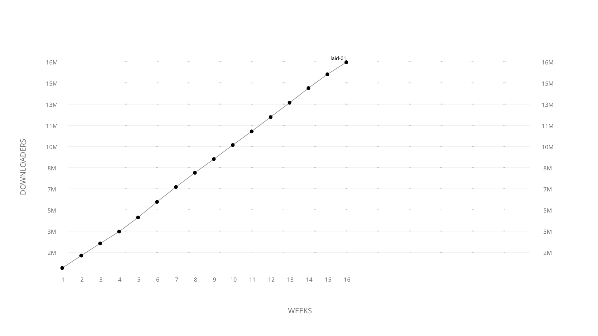
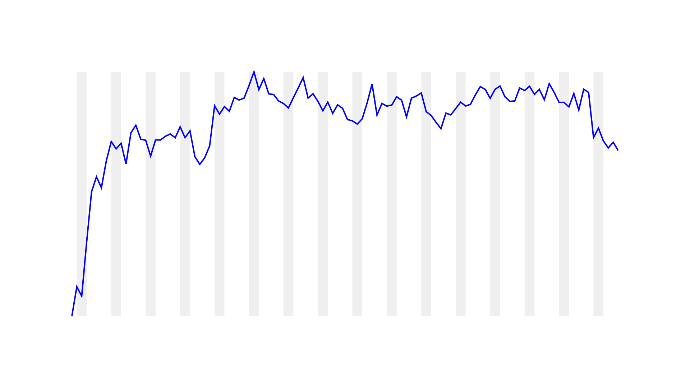
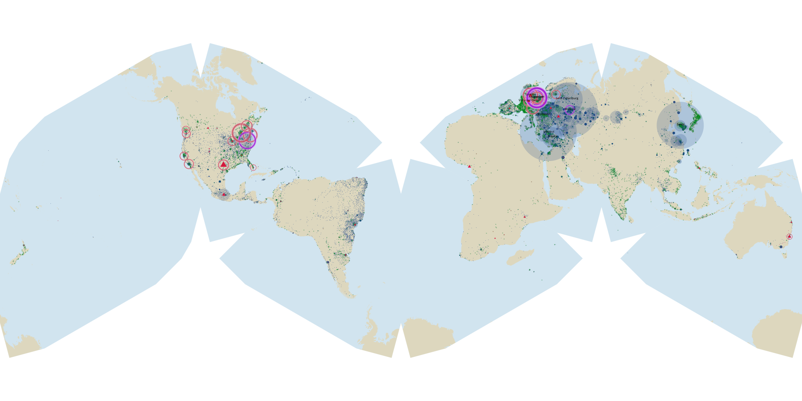

# Laid sample cache audit

## 1. Media object

| Field | Value |
| --- | --- |
| Media object | Laid |
| Collection key | `laid-01` |
| Sample dates | 2024-12-19-to-2025-04-09 |
| Sample days | 112 (2024–2025) |
| BTIH count | 278 |
| Unique BTIH count | 255 |
| Downloaders total | 16,843,064 |
| Uploaders total | 289,940 |
| Data version | `2026-08-05` |
| IP geolocation version | `6:1777968300` |

## 2. Cache coverage report

- Generated: 2026-08-21T05:55:26Z
- Sample directory: `/home/bkoz/src/alpha60-samples/laid-01`
- Hour directories: 2666
- Zero-length sample files: 0
- Other unparsable sample files: 0
- Hourly discontinuities: 1 (1 missing hours)
- Missing days: 0

### Sample archive discontinuities

- hourly gap: last `2025-03-30 01:06`, resumed `2025-03-30 03:06` — missing 1 hour(s)

### Review

Confirm the sampler state and disk capacity on the sampling
hosts for every zero-length file and discontinuity above
before treating the aggregate outputs as complete.

## 3. Visualization pass — graphs

### Downloads by week cumulative (normalized start)

### Downloads by day, Saturday and Sunday in gray

## 4. Visualization pass — maps

### Cumulative geographic map

### Cumulative data maps

